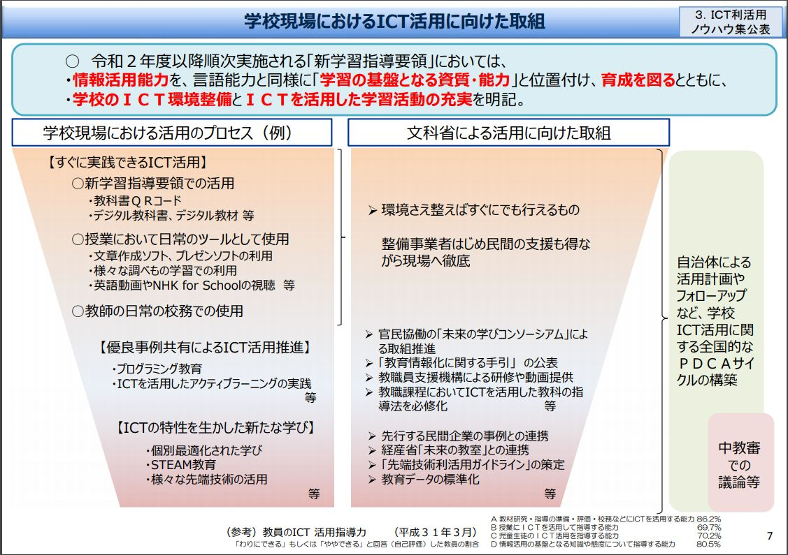

# 議案第17号 令和2年度小平市一般会計補正予算（第2号）

<i class="fa fa-gavel" aria-hidden="true"></i> 総務委員会付託

<fieldset class="point">
  <legend>
    <h2 class="point"> ポイント </h2>
  </legend>
  
<i class="fa fa-check" aria-hidden="true"></i> 新型コロナ感染症対策関連と、その他に関する補正予算

  
<i class="fa fa-check" aria-hidden="true"></i> 総額約18億円のうち、小平市の負担分は財政調整基金から9,000万円

  
<i class="fa fa-check" aria-hidden="true"></i> GIGAスクール構想で、小中学校の児童・生徒へタブレット一人一台配布、総額約7億円

  
<i class="fa fa-check" aria-hidden="true"></i> 中小企業支援給付金、子育て世帯への臨時特別給付金、住居確保給付金等

</fieldset>

<fieldset class="sanpi">
  <legend>
    <h2 class="sanpi"> <i class="fa fa-circle-o" aria-hidden="true"></i> 私（安竹洋平）の判断：賛成 </h2>
  </legend>
  
<i class="fa fa-circle-o" aria-hidden="true"></i> 以下の懸念・問題点はあるものの、急を要することでもあり、賛成

  
<i class="fa fa-exclamation-triangle" aria-hidden="true"></i> 支援が必要な人たちの実態を把握する姿勢が不足しているのでは

  
<i class="fa fa-times" aria-hidden="true"></i> GIGAスクール構想は短期間で集中的にエネルギーを注ぐべきだがリソース不足感あり

  
<i class="fa fa-times" aria-hidden="true"></i> 追加で必要になる補正予算を迅速に決定できる仕組みがない

</fieldset>

<fieldset class="point">
  <legend>
    <h2 class="point"> 早急な支援策を講じるための附帯決議案は、否決されました </h2>
  </legend>
  
この委員会において、当一人会派の会から（中江美和議員と伊藤央議員がとりまとめ、橋本久雄議員が調整し）、委員の橋本久雄議員により附帯決議案を提出しましたが、残念なことに賛成少数で否決されてしまいました。附帯内容は、市民生活や事業活動、教育等に必要な支援策を講じ、必要に応じて臨時議会を招集し議会に諮る、というものです。つまり、臨時会議を必要であればいつでも開けるようにして、迅速な意思決定がなされることを目的とするものです。
  
  6月定例会には新たな補正予算案を上程しないという執行部からの説明があったため、それではあまりにも動きが遅すぎるという理由から提出したもので、時期に即した非常に良い提案です。反対した議員は意見表明もなかったため、何を考えているのか全く分かりません。小平市議会では良くこういうことが起きます。市民のためといつも言っているのですから、反対であれば少なくともその趣旨を説明すべきです。残念でなりません。

</fieldset>

## 概要
新型コロナウイルス感染症が拡大する中、市内の事業活動や市民生活を守るために、国や東京都の補正予算等を最大限活用し、市としての緊急対策に取り組むとともに、小・中学校におけるGIGAスクール構想の実施や、当初予算編成後に新たに実施することとなった事業に関する経費等を計上するもの。

歳出歳入それぞれ17億870万9千円を増額。財源は国と都、財政調整基金からの繰入金で対応。

- 家庭学習用モバイルルーターは、通信環境が整っていない家庭にタブレットPCとモバイルルーターを貸与するための経費
- 新設の都市農地保全支援プロジェクト事業は、農地の防災機能強化を図るため、東京むさし農協が実施する防災兼用井戸設置の支援に係る経費

内容の詳細は[会議録](./index.md#会議録配布資料)を参照してください。

## 主な内訳

## 議案第17号 主な質疑
＊要約です。正確な質疑内容は[会議録](./index.md#会議録配布資料)をご参照ください。

{{#include ../partials/situgi_hanrei.md}}
### 本会議にて
 {{#include ../partials/yasutake-speak.md:1}} 委員会付託議案については、本会議で質問できるのは大綱のみ（部長レベルで回答できる質問のみ）とされています。一人会派の会は、総務委員会委員の橋本氏を除く3名全員が大綱で質問しました。その他質問したのは無会派の水口氏だけでした。総務委員会に付託してそこで詳細質問ができるとはいえ、委員会は全ての議員が出席できるわけではありません。これだけの規模の予算に対し、大綱で質問がないというのは不思議なことです。

<table class="qanda"><tr><td><i class="fa fa-question-circle hitori" aria-label="一人会派の会 議員による質問"></i></td><td>
新型コロナウイルス対策施策の予算はどれくらいか。（中江 美和）
</td></tr></table>

>総額約17億円。コロナ対策以外が約4,800万円、全体の97％以上がコロナ対策。（津嶋 企画政策部長）

 
<table class="qanda"><tr><td><i class="fa fa-question-circle hitori" aria-label="一人会派の会 議員による質問"></i></td><td>
コロナ対策として市民の生命と生活を守るためのニーズに対し、どういう観点から事業を選んだか。（中江 美和）
</td></tr></table>

> 市の全体フレーム、財源構成を考えながら、国及び都が実施しているもので、行き届かない部分を中心に市民生活を支える。市内事業者、市民からの声を総合的に判断。（津嶋）

 
<table class="qanda"><tr><td><i class="fa fa-question-circle hitori" aria-label="一人会派の会 議員による質問"></i></td><td>
各自治体では独自事業を展開している。調布市はドライブスルー、あきる野市は在宅児童への食事提供など。小平市の独自事業は。（中江 美和）
</td></tr></table>

> 第3款、民生費高齢者福祉費・障害者自立支援費、福祉事業所における感染症対策の備品等補助と経営の支援。福祉施設は東京都の休業要請の対象外のため、小平市としてサポート必要。
第7款の商工費、店舗を狩りて経営している中小企業・個人事業主に対する家賃支援、国の支援が届かない部分。6月以降は国も家賃支援を行うようだが、そこまでは小平市が支援。（津嶋）

 
<table class="qanda"><tr><td><i class="fa fa-question-circle hitori" aria-label="一人会派の会 議員による質問"></i></td><td>
新型コロナウイルス対策とは関係ない予算がある、これらはなぜ当初予算に計上しなかったか。コロナがなければ6月定例会で補正予算として計上されたか。（中江 美和）
</td></tr></table>

> 当初予算で組む予定だったが、都の予算見込みが立たなかったため外していた。計上されてきたことから早めた。（津嶋）

 
<table class="qanda"><tr><td><i class="fa fa-question-circle hitori" aria-label="一人会派の会 議員による質問"></i></td><td>
補正3号はないとのこと。今後も状況を見ながら臨時議会なり補正予算で市民のニーズを汲み取って予算措置を対応するか。（中江 美和）
</td></tr></table>

> 次の議会を待つと９月、審議して成立しても９月末、それまでに対応が必要な場合は改めて臨時議会で対応する。（津嶋）

 
<table class="qanda"><tr><td><i class="fa fa-question-circle hitori" aria-label="一人会派の会 議員による質問"></i></td><td>
タブレット配備2023年までを前倒し、どいういう理由で今回可能になったか。導入の道筋は。（中江 美和）
</td></tr></table>

> 新型コロナの影響が長期化し、家庭における使用がニーズとして出てきたことを最重要課題ととらえた。国や都が前倒しの予算措置拡充、財政支援拡充が諮られた。有利な条件で整備の条件が整った。一人一台の端末確保、家庭におけるLAN環境の整備を進め学びの環境を整える。（川上教育部長）

 
<table class="qanda"><tr><td><i class="fa fa-question-circle hitori" aria-label="一人会派の会 議員による質問"></i></td><td>
タブレットメンテナンス、保守管理に人員増加が不可欠、運営体制はどうなっているか。（中江 美和）
</td></tr></table>

> 保守管理等の多くは業者に委託して対応。職員の関わりは検討して必要な人員確保に努める。生産も需要が全国的に増えているため強化する、揃ったものから順次配備の可能性も。（川上）

 
<table class="qanda"><tr><td><i class="fa fa-question-circle hitori" aria-label="一人会派の会 議員による質問"></i></td><td>
今回会派への事前説明がなく、分からなったので一つずつ聞く。防災関係団体の育成事業はコロナ禍に関係しているのか。内容は。（伊藤 央）
</td></tr></table>

> コロナ対策事業ではない。昨年10月に申請、年度末に決定したもの。本来なら6月だった。自主防災組織に防災資機材を手当するもの。（河原 危機管理担当部長）

 
<table class="qanda"><tr><td><i class="fa fa-question-circle hitori" aria-label="一人会派の会 議員による質問"></i></td><td>
市民文化会館管理運営事業とは何か。（伊藤 央）
</td></tr></table>

> 使用料として納めてもらった金額について、公演等が中止された関係で戻すもの。一度市の歳入として入っているもの。（篠宮 健康・保険担当部長）

 
<table class="qanda"><tr><td><i class="fa fa-question-circle hitori" aria-label="一人会派の会 議員による質問"></i></td><td>
子育て世代包括支援センター事業の記念品等育児パッケージの内容は。（伊藤 央）
</td></tr></table>

> 平成29年度から育児パッケージ妊婦面談の際に実施、令和2年度限りでさらに1万円をプラスして支給。（篠宮）

 
<table class="qanda"><tr><td><i class="fa fa-question-circle hitori" aria-label="一人会派の会 議員による質問"></i></td><td>
小平市女性再就職サポート事業の内容は。（伊藤 央）
</td></tr></table>

> 東京都の補助金を活用し、結婚や育児で再就職を希望している女性を対象に、職場復帰のための総合研修を実施し、その後マッチングにより再就職をサポート。（余語 地域振興部長）

 
<table class="qanda"><tr><td><i class="fa fa-question-circle hitori" aria-label="一人会派の会 議員による質問"></i></td><td>
小平販売促進とはどういった補助金か。（伊藤 央）
</td></tr></table>

> 緊急臨時に予算執行、商工会の方でデリバリーの実施に関してアンケート調査を行い、それに基づき、こだいらデリ・リーフレットを作成したもの。（余語）

 
<table class="qanda"><tr><td><i class="fa fa-question-circle hitori" aria-label="一人会派の会 議員による質問"></i></td><td>
GIGAスクール構想、これまでに教員の方はどんな研究を進めてきたか、配ってすぐ活用できるものか。２３区でもかなり苦労して研究等行っているが。（伊藤 央）
</td></tr></table>

> 情報教育推進委員会でタブレットの利用による授業の行い方や教材開発等について、一校から一人来てもらい研究を進めている。文科省の「学校現場におけるICT活用における取組」等を踏まえて、できることをなんでもやってみる。配備されたところから取組進める（国冨 教育指導担当部長）
>
> 
> [文科省：「児童生徒1人1台コンピュータ」の実現を見据えた施策パッケージ](https://www.mext.go.jp/a_menu/other/index_00001.htm)より
 
<table class="qanda"><tr><td><i class="fa fa-question-circle hitori" aria-label="一人会派の会 議員による質問"></i></td><td>
小学校給食運営事業の給食補償費、どんな補償に充てられているか。（伊藤 央）
</td></tr></table>

> 3月及び4月に発注した給食食材のキャンセル分廃棄費用を違約金として支払うもの。野菜、乳製品、米、パンなど。（川上）

 
<table class="qanda"><tr><td><i class="fa fa-question-circle hitori" aria-label="一人会派の会 議員による質問"></i></td><td>
調理員の給与補償はどこかに計上されているのか。（伊藤 央）
</td></tr></table>

> 3月の委託料を減額したが、給料補償として補償金を支払っている。４月分は国の雇用調整助成金（通常補償の６割程度補償）に入らなかった分を市で補填していく予定。（川上）

 
<table class="qanda"><tr><td><i class="fa fa-question-circle hitori yasutake" aria-label="安竹による質問"></i></td><td>
歳出を一般財源の金額順に並べると、一番多いのが小平市中小企業支援給付金事業で一般財源から3,625万2千円、その次がルネ小平（市民文化会館）の1,398万5千円。市へのインパクトで考えるとルネ小平への還付金が2番目に大きいにもかかわらず、市長からの報告に含まれていないのはどういう理由か。（安竹 洋平）
</td></tr></table>

> 事業費ベースでみるとコロナ対策の方が金額が大きい。還付金は義務的に返さなければならないもので、予算を上回る額になったため計上した。（津嶋）

 
<table class="qanda"><tr><td><i class="fa fa-question-circle hitori yasutake" aria-label="安竹による質問"></i></td><td>
なぜルネ小平の使用料は先に徴収し、後から還付する仕組みになっているか。（安竹 洋平）
</td></tr></table>

> 年度をまたいで返さなければいけない。ルネ小平は規模が大きいので、部屋の予約を入れて料金を事前に納付してもらっている。昨年度納付分。還付は多少計上していたが、予想外だったので。

 
<table class="qanda"><tr><td><i class="fa fa-question-circle hitori yasutake" aria-label="安竹による質問"></i></td><td>
ルネ小平への還付金は、新型コロナ感染の影響を受け、市への収入が減るという話。市へのインパクトを見積る際に重要な情報だが、市長の報告に含めていないことは問題では。（一方では）市へのインパクトを考慮し、国や都の予算を期待し、（一方では歳入の大幅な減少が市長の報告に乗ってこない）。チグハグ感があるのでは。（安竹 洋平）
</td></tr></table>

> 財政へのインパクトは大きい。総合体育館など、他でも収入が減っている部分があり、全体を注視していきたい。まずは市民への経済支援に関して述べさせていただいている。これは返さないといけない部分のため、市長の報告には盛り込まなかった。（津嶋）

 
<table class="qanda"><tr><td><i class="fa fa-question-circle-o" aria-label="その他 議員による質問"></i></td><td>
給食食材、市内の農家も補償の対象か。
</td></tr></table>

> 給食を提供するにあたって市内農家から直接買い付けている農作物も補償の対象。（川上 教育部長）

 
<table class="qanda"><tr><td><i class="fa fa-question-circle-o" aria-label="その他 議員による質問"></i></td><td>
住居確保給付金の申請はどれくらい増えているか、何名想定しているか。足りているか。
</td></tr></table>

> 例年毎月２～３件程度、５月だけで７７件来ていると社協から聞いている。そのため増額。当初予算では単身世帯は１２件で見積っていた、補正予算でプラス１８０件増とした。２人以上の複数世帯は当初予算５件を２５件に増額。当面は不足しないと考えている、不足なら補正予算で計上。（滝澤 健康福祉部長）

 
<table class="qanda"><tr><td><i class="fa fa-question-circle-o" aria-label="その他 議員による質問"></i></td><td>
障害者事業継続支援事業、介護事業者継続支援事業、継続が困難という声が届いているか。
</td></tr></table>

> 事業所にもよる。通所事業所と居宅型で差はある、介護の通所事業所を中心に収入が落ちていると聞いている。消毒用マスク、消毒液、感染予防の備品が不足しているため経費補填で計上。（滝澤）

 
<table class="qanda"><tr><td><i class="fa fa-question-circle-o" aria-label="その他 議員による質問"></i></td><td>
家庭学習通信環境整備支援事業のモバイルルーター３８０万円借り上げ、通信運搬費1140万円、ルーター何台で何か月の貸出を予定しているか。金額が少ないようだが十分か。
</td></tr></table>

> 380台を6か月貸し出す。タブレットが各学校20台あり、19校分で380台貸出可能。タブレットを家庭で使えるようにする設定費も計上している。各家庭にICT環境調査を行っており、足りなくなる可能性もあるが東京都の方で支援が見込めるのでそれを活用する予定。（国冨）

### 総務委員会にて
総務委員会には、一人会派の会からは橋本久雄議員が参加しています。

#### GIGAスクール構想関連の質疑
<table class="qanda"><tr><td><i class="fa fa-question-circle-o" aria-label="その他 議員による質問"></i></td><td>
導入までのスケジュールは。
</td></tr></table>

> 機器の仕様は未決定、教育内容等により機器も変わる、機器を考えた上で入札をし、本年度末までに順次納品。

 
<table class="qanda"><tr><td><i class="fa fa-question-circle-o" aria-label="その他 議員による質問"></i></td><td>
家庭と学校での運用は。
</td></tr></table>

> 現在のコロナウイルス感染症対応として家庭に持ち帰ることも想定。その際は、現場を良く知る教員があらゆる工夫を家庭と共にできる環境整備が必要。たとえば、
> - 持ち帰る際の設定変更
> - 不要なソフトウェアを入れられないように

 
<table class="qanda"><tr><td><i class="fa fa-question-circle-o" aria-label="その他 議員による質問"></i></td><td>
GIGAスクール導入の全体のフレームを、校長と話しながらか、他市の例を見ながらか、どういう手順で実のある教育につなげていけるか。
</td></tr></table>

> 大きく分けてフレームは2点ある。1点目は調達に関わるフレーム、2点目は学校で運用するためのフレーム。両方並行に進め、学校の運用はパソコン等に卓越した学校教員や校長の協力をもらいながら行う。

 
<table class="qanda"><tr><td><i class="fa fa-question-circle-o" aria-label="その他 議員による質問"></i></td><td>
タブレットPCは何年使用する想定か。更新の費用負担はどれくらいか。その際補助は見込めるのか。
</td></tr></table>

> リースであれば現時点で5年のリースを行っており、それくらいの期間が想定される。リースか購入かは決まっていない。更新費用は今回と同程度かかると予想。昨年度、文科省から、買い替えの補助についても検討という言葉もあったため、今後の国の動向を注視。

 
<table class="qanda"><tr><td><i class="fa fa-question-circle-o" aria-label="その他 議員による質問"></i></td><td>
学校ごとに差が生まれるような状況にないか。
</td></tr></table>

> 現在のGIGAスクールやオンライン学習はできる学校からどんどん進めてもらいたいと考えている。待っていると何も進まなくなる。ある学校で進んでいるものを暗黙知とすると、それを他の学校も形式知として広げられるような仕組みづくりが必要と考えている。昨日の校長会でも、動画の配信やオンライン学習教材の活用などについて、相互の学校間でできること、なんでも使えるものは使おうと周知した。これまでの一律というルールにとらわれない形が必要。タブレット提供の期間までについても、できることを進めていく学校から、どんどんそのやり方を他の学校にも広めていくことが課題。

#### 家庭学習通信整備支援（家庭用モバイルルーター貸出）事業関連
<table class="qanda"><tr><td><i class="fa fa-question-circle hitori" aria-label="一人会派の会 議員による質問"></i></td><td>
通信環境が整っていない家庭の調査はしているか。（橋本 久雄）
</td></tr></table>

> 調査をし、把握している。

 
<table class="qanda"><tr><td><i class="fa fa-question-circle hitori" aria-label="一人会派の会 議員による質問"></i></td><td>
現在、貸与機器はどれだけ保有しているか。（橋本 久雄）
</td></tr></table>

> タブレットPCは380台保有、ルーターは調達可能。

 
<table class="qanda"><tr><td><i class="fa fa-question-circle-o" aria-label="その他 議員による質問"></i></td><td>
これはオンライン授業前提で行うものか。
</td></tr></table>

> オンライン授業の前提ではなく、オンライン学習、オンライン上での教材を活用した学習を想定。現在回線容量が30Mbpsのため、一人当たり2Mbpsとすると15人で一杯になってしまう。臨時休業、もしくは分散登校における家庭学習の支援として、緊急的な措置として考えている。

 
<table class="qanda"><tr><td><i class="fa fa-question-circle-o" aria-label="その他 議員による質問"></i></td><td>
GIGAスクールでのタブレット一人一台との関わりは。
</td></tr></table>

> GIGAスクールにおいては、通信環境の設置もあり、1Gbpsとなる。短期的には家庭学習の通信環境支援事業、中長期的にはGIGAスクール構想で考えている。

 
<table class="qanda"><tr><td><i class="fa fa-question-circle-o" aria-label="その他 議員による質問"></i></td><td>
どの科目やどの学年を重点的に対象としているか。
</td></tr></table>

> 特定の科目や学年の想定はない。採択している教科書会社において、オンライン学習の教材をかなり現在の状況に合わせて開発してくれている。様々なワークシート、動画資料なども提供してもらっているので、こういったものを活用できるなら全ての学年で行えると考えている。小学1年、2年生等が子どもだけでうまく活用できると思わないので、上級学年、中3、中2が大きく使えると考えている。

 
<table class="qanda"><tr><td><i class="fa fa-question-circle-o" aria-label="その他 議員による質問"></i></td><td>
ルーターはいつ受け取れるか。
</td></tr></table>

> これから各家庭に申請をしてもらう。申請してもらった数が用意している380台を超える場合は、受験等が関わる中3、中2等、上級学年から順次配備する。足りなかった分は東京都で追加の貸出しを検討しているという通知があり、それらを活用する。

#### マイナポイント関連
 
<table class="qanda"><tr><td><i class="fa fa-question-circle-o" aria-label="その他 議員による質問"></i></td><td>
マイナポイントの予約支援を入れると、何が生きるか。
</td></tr></table>

> 令和2年9月から始まるマイナポイント事業に関わるもの。マイナンバーカードのマイキーID設定は基本的に自分のPCにカードリーダー等を接続して行うが、パソコンやカードリーダー等がない方のために市町村でマイキーID設定を可能にする端末を用意し、そこで設定方法の案内、支援を行う。

 
<table class="qanda"><tr><td><i class="fa fa-question-circle-o" aria-label="その他 議員による質問"></i></td><td>
スケジュールは。
</td></tr></table>

> スケジュールとしては、実際にチャージしたり購入する等のポイント事業は9月から。7月から決済事業者の選択、もしくは登録が開始するため、そのタイミングで窓口を設置。

 
<table class="qanda"><tr><td><i class="fa fa-question-circle-o" aria-label="その他 議員による質問"></i></td><td>
このタイミングで入れた理由は。
</td></tr></table>

> このタイミングになった理由は、まず、交付要綱が今年の2月20日で当初予算編成が見込めなかった。6月補正予算で予定していたが7月から開始なのでなるべく駛馬ということで。
>
> マイナポイント事業の詳細が不明で、他市の状況を見ながらそれまでの補助金には手を付けなかったが、マイナンバーカードの申請も増えてきたため今回予算化した。

 
<table class="qanda"><tr><td><i class="fa fa-question-circle-o" aria-label="その他 議員による質問"></i></td><td>
特別定額給付金とは関係があるか。
</td></tr></table>

> 特別定額給付金とは関係がない。消費増税からの一連の部分で、キャッシュレス還元事業が6月で終わるため次の消費活性化策としての事業。

 
<table class="qanda"><tr><td><i class="fa fa-question-circle-o" aria-label="その他 議員による質問"></i></td><td>
多くの人がマイナンバーカードを作りに来ると3密も予想される。体制はできているか。
</td></tr></table>

> 今回の定額給付金のようなことは想像できなかったところなので、公布担当の市民課も含めて、対策について留意する。

 
<table class="qanda"><tr><td><i class="fa fa-question-circle hitori" aria-label="一人会派の会 議員による質問"></i></td><td>
マイナポイントの消費活性化政策について、国は20～25%還元するといっている、それと関連した事業なのか。（橋本 久雄）
</td></tr></table>

> 国が言っているその事業。マイナンバーカードを使って、マイキープラットフォーム経由で、キャッシュレジ事業者から得られるマイナポイントを用いて消費の活性化、官民キャッシュレス決済基盤の構築等を目的とした事業。マイナポイントは決済サービスの利用額に応じて付与され、前払いまたは物品の購入時に25％付与される。ポイント付与は上限5,000円分まで。

 
<table class="qanda"><tr><td><i class="fa fa-question-circle hitori" aria-label="一人会派の会 議員による質問"></i></td><td>
いつからいつまでか。（橋本 久雄）
</td></tr></table>

> ポイント事業の期間は、今年の9月から来年の3月まで。ポイントの付与が3月になった場合については、国としては3か月程度はポイントが使えるようにだが、各決済事業の期間によって変わる。

 
<table class="qanda"><tr><td><i class="fa fa-question-circle hitori" aria-label="一人会派の会 議員による質問"></i></td><td>
マイナンバーカードがないとその制度に入れないということで良いか。（橋本 久雄）
</td></tr></table>

> 参加するための手続きが必要なため、今回のマイナポイント予約という支援事業を行うことになった。

#### 住宅確保給付金関連
 
<table class="qanda"><tr><td><i class="fa fa-question-circle-o" aria-label="その他 議員による質問"></i></td><td>
住居確保給付金について、社協の生活相談支援センターがつながりにくいという話もあり、人員上の問題はないのか。
</td></tr></table>

> 社協の中で応援体制を組んで対応している。生活相談支援センター本来は5名のところ、ボランティアセンターから2名を配置。ただしボランティアセンターも今後開所するところもあるため、その人員に対応するため委託費の増額をしている（予算書P11、140万円増）。

 
<table class="qanda"><tr><td><i class="fa fa-question-circle hitori" aria-label="一人会派の会 議員による質問"></i></td><td>
ホームページには、住宅確保給付金と、離職等で賃貸住宅の家賃支払いにお困りの方という二つの事業が並べて表示されており、表現も分かりづらい。見る人が分かりやすくなる整理を。（橋本 久雄）
</td></tr></table>

> 実際に家賃相当額を補償する一般の方に対して行う制度は住居確保給付金のみ。ホームページのあり方は調整する。
>
> 実際は同じ住居確保給付金に関するものが、社協に委託しているためそのページと、今回のコロナ対策用のページがあり、混乱を招いていた。今後は解消する。

 
<table class="qanda"><tr><td><i class="fa fa-question-circle-o" aria-label="その他 議員による質問"></i></td><td>
給付期間の想定と、入金までの時間は。
</td></tr></table>

> 実績からおおむね5か月を想定。入金まではおおむね3週間。

#### 小規模多機能型居宅介護 補助金関連
 
<table class="qanda"><tr><td><i class="fa fa-question-circle-o" aria-label="その他 議員による質問"></i></td><td>
P11の、施設開所準備経費等支援事業について、小規模多機能型居宅介護の受入れ可能人数は。
</td></tr></table>

> デイサービスの利用者として16名、宿泊の利用者として8名を予定。

＊参考：[令和2年6月1日小規模多機能　学園通り　新規オープン予定](http://nanokakai.jp/blog/22582.html)
　ここに人数の記載あり。

#### 中小企業支援給付金事業関連
 
<table class="qanda"><tr><td><i class="fa fa-question-circle-o" aria-label="その他 議員による質問"></i></td><td>
対象者は市の方で把握しているか。いつから起業の方が対象か。
</td></tr></table>

> 予算は、プレミアム商品券の際に利用したNTTデータの起業情報や商工会の会員情報を参考に算出。令和2年3月1日以前の起業が対象。

#### 財政調整基金関連
 
<table class="qanda"><tr><td><i class="fa fa-question-circle-o" aria-label="その他 議員による質問"></i></td><td>
財政調整基金9,000万円を投入しているのは他市と比べて多いか。
</td></tr></table>

> 電話等で口頭の確認だと、一般財源を入れているところ、国や都から独自につかってくださいと言われている補助金・臨時交付金を使った事業を展開するところもある。平均して多いか少ないかはまだデータがとれていない。残高に対して9,000万円は割合として高いと考えている。

#### 障害事業所等継続事業関連
 
<table class="qanda"><tr><td><i class="fa fa-question-circle-o" aria-label="その他 議員による質問"></i></td><td>
対象となる事業所と、金額が妥当なのか
</td></tr></table>

> 障害者事業所への支援金は基本4月5月の各月10万円、上限20万円。20事業所を予定。その他マスクや消毒液、備品等の補助金が上限10万円で70事業所を予定。合計1,100万円。

 
<table class="qanda"><tr><td><i class="fa fa-question-circle hitori" aria-label="一人会派の会 議員による質問"></i></td><td>
それぞれの事業所に案内を。（橋本 久雄）
</td></tr></table>

> 対象となる100近くの事業所には、この事業を始めたという周知を郵送している。

 
<table class="qanda"><tr><td><i class="fa fa-question-circle hitori" aria-label="一人会派の会 議員による質問"></i></td><td>
今どういう課題があるのか、何が困っているのか、アンケート調査の実施を。ある事業所では、ベッドから車椅子へ乗せるのに抱きかかえて移動する、その際に防護服が必要で自分たちで作ったと。濃厚接触がイヤで2名辞めた事業所もある。そういったことをすべてアンケートで洗い出し、必要な支援を。（橋本 久雄）
</td></tr></table>

> 上記の郵送による周知でやりとりしていく中で、困り事があった場合の内容について把握し、この事業に当てはまるかどうかの検討をしていく予定なので、アンケートは実施しない。

 
<table class="qanda"><tr><td><i class="fa fa-question-circle hitori" aria-label="一人会派の会 議員による質問"></i></td><td>
郵送による案内に添付して、今どういう困難に直面している、何が困っているかアンケートを行えばいいと考えるが、なぜできないのか。（橋本 久雄）
</td></tr></table>

> 今回の事業スキームを検討する際にサービス提供事業者、移動支援事業者から話を得ている。全件ではないが、人件費を含めて影響が出ている、収支が三、四割影響を受けているといった話を得て把握している。今後も把握に努める。

 
<table class="qanda"><tr><td><i class="fa fa-exclamation-circle hitori" aria-label="一人会派の会 議員による意見"></i></td><td>
コロナの第二、第三波、10年前はインフルエンザもあったわけだから10年周期でこういうものが起きる可能性がある。今回の取組を蓄積し、次につなぐ必要がある。情報の収集、データの収集は大事。障害者団体、高齢者団体がどういう問題、どういう課題にぶつかったか、行政としてしっかり把握しておかなければならないという思いがあり、アンケート調査が必要と言っている。（橋本 久雄）
</td></tr></table>

#### 介護事業所等継続事業関連
 
<table class="qanda"><tr><td><i class="fa fa-question-circle-o" aria-label="その他 議員による質問"></i></td><td>
対象となる事業所と、金額は妥当か。
</td></tr></table>

> 介護事業所で対象となる事業は2種類。1つ目は、市内すべての介護サービス事業所240事業所を対象に、新型コロナ感染拡大防止に関する経費補助で10万円、合計2,400万円を予定。2つ目は、利用者減少により4月、5月の売上が昨年度比20％以上減少している事業所を対象に月10万円支給。約80事業所を予定し、合計1,600万円を予定。

#### 子育て世帯への臨時特別給付金事業関連
 
<table class="qanda"><tr><td><i class="fa fa-question-circle-o" aria-label="その他 議員による質問"></i></td><td>
小平市における独り親家庭の世帯数は。そういった世帯への上乗せはできるか。
</td></tr></table>

> 独り親家庭の世帯数を把握することは非常に困難。正しい数字はないが参考になる数字として、児童扶養手当の受給世帯数があり、令和2年度で960世帯。
> 
> 上乗せは市の負担になるため財政上大変厳しく今は考えていない。国の方で児童扶養手当増額の法案が出ている話があるため動向を注視。

#### 給食費関連
 
<table class="qanda"><tr><td><i class="fa fa-question-circle-o" aria-label="その他 議員による質問"></i></td><td>
市内の地元農産物をを扱っている対象者は何件か。あるいは市内に関わる保証金額の内訳は。
</td></tr></table>

> 給食に納品している市内農家は具体的な数字は把握していないが、直接契約は十数件。金額も定まっておらず各農家と調整しながら精査中。

#### 育児パッケージ関連
 
<table class="qanda"><tr><td><i class="fa fa-question-circle hitori" aria-label="一人会派の会 議員による質問"></i></td><td>
タクシー移動に使えるチケット配布の話もあるが、それは実施するのか。上乗せ1万円分に含まれるのか。（橋本 久雄）
</td></tr></table>

> 今回妊婦に渡すのは、現金ではない。平成29年から妊娠届の際に渡している子ども商品券1万円分に上乗せて、今回こども商品券1万円分を差し上げるもの。このこども商品券を、東京都で、タクシーでの移動に使えるようにするということで補助金が出る。現在配布している子ども商品券は区内のタクシー業者では使える。小平市内のタクシー会社とも現在交渉中で、前向きに検討している会社もある。タクシー会社へのサポートは今のところ考えていない。

 
<table class="qanda"><tr><td><i class="fa fa-question-circle-o" aria-label="その他 議員による質問"></i></td><td>
3,4,5月に出産された方は大変な思いをして出産している。それらの方も対象にならないか。
</td></tr></table>

> 配布時に妊婦であることが要件になっており、対象とならない。産前産後サポート事業や新生児訪問、子育て世代包括支援センターのような既存の事業の中でケアしていく。

#### 都市農地保全支援プロジェクト関連
<table class="qanda"><tr><td><i class="fa fa-question-circle-o" aria-label="その他 議員による質問"></i></td><td>
この事業で掘られたものは小平市の防災用井戸に指定されるのか。指定するなら飲用になるよう、深く掘るなど水質が担保できるようにすべきでは。
</td></tr></table>

> 都の事業としての目的自体が、農業用井戸ということが一点ある。飲用に適していなければ生活用水として利用する状況になる。

#### その他全般のこと
 
<table class="qanda"><tr><td><i class="fa fa-question-circle hitori" aria-label="一人会派の会 議員による質問"></i></td><td>
コロナの第二波、第三波もあると言われており、リーマンショック以上の経済的落ち込みが予想されている。小平市も不要不急の事業は大胆に見直しをする必要があると考える。そういう検討は始めているか。三つの都市計画公園が同時に動き出している、当面凍結という判断も必要と考える。東京都の補助金が減る可能性も大きいなかで、来年度予算に向けた取組が必要。都市計画道路も凍結したらいいと考えている。小平市としてはどういうスケジュールで見直しをするか。（橋本 久雄）
</td></tr></table>

> 今年度の事業も含めて見直しを進めている。

 
<table class="qanda"><tr><td><i class="fa fa-question-circle hitori" aria-label="一人会派の会 議員による質問"></i></td><td>
この補正予算で独自事業はあるのか。（橋本 久雄）
</td></tr></table>

> ある。障害事業所等への業務継続支援事業、介護事業所業務継続支援事業、小平市中小企業等支援給付金事業、この三つは完全に市の独自事業と考えている。

 
<table class="qanda"><tr><td><i class="fa fa-question-circle hitori" aria-label="一人会派の会 議員による質問"></i></td><td>
ホームページが見にくい。専用の相談コーナーを作ってそこで対応してもらう体制はどうか。（橋本 久雄）
</td></tr></table>

> 市としては分野ごとに分けて行きつきやすい環境を整えている。問題があれば個別のご指導を。
>
>専用コールセンターの設置は、結局一回そこで受けてもまた次に回すことになるので、まずはホームページで整理して個別の施策についてはそこでしっかり答えができるようにしたい。

 
<table class="qanda"><tr><td><i class="fa fa-exclamation-circle hitori" aria-label="一人会派の会 議員による意見"></i></td><td>
意見: なぜ対策本部の議事録を公開しないのか。（橋本 久雄）
</td></tr></table>

 
<table class="qanda"><tr><td><i class="fa fa-question-circle-o" aria-label="その他 議員による質問"></i></td><td>
学校再開時に子どもが学校に行きたくなるような取組があれば。
</td></tr></table>

> 新しいことを行っていくよりも、現時点で重要なのは子どもと教員の、感染症予防に向けた行動変容が一番大事。その理解を図るための指導をまず始めに充実させる。

 
<table class="qanda"><tr><td><i class="fa fa-question-circle-o" aria-label="その他 議員による質問"></i></td><td>
独自の事業として、例えば江戸川区では、どんな支援が必要かという生活支援策を職員から募集し、1,000件提案があり、うち60件に着手した。そのような職員や市民から声を聴取する動きはあるか。
</td></tr></table>

> 所管課がそれぞれの事業所や市民の声を聴きながら、今回事業を練ってきた。今後も、国の方で第2弾の補正を組んでいくであったり、都でも5月の補正等々これから対策を打っていくところもある。経済的な支援が一番課題だが、それに対して市が直接的に介入するのは財源的に難しい部分がある。国や都でなかなか手立てができないところの困っている方に対しては市で何かできないかという視点で今後も考えていくが、まずは国や都の状況も踏まえながらどういう対応ができるかは今後の研究課題。

 
<table class="qanda"><tr><td><i class="fa fa-question-circle-o" aria-label="その他 議員による質問"></i></td><td>
マイキーIDや定額給付金の話で、会計年度任用職員にを採用する話がある。小金井市の取組で、コロナ禍で雇止めにあった人や職を失った人を積極的に雇用する動きがあるが、小平市は。
</td></tr></table>

> 小平市では表立ってそのような動きは大きく出ていないので、他市の状況も踏まえながらの研究課題。

