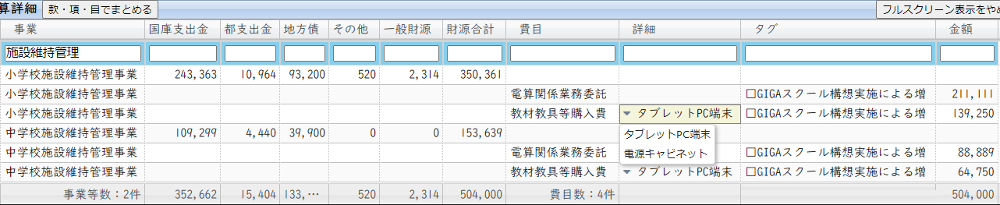

# 議案第44号 令和2年度小平市一般会計補正予算（第4号）

<i class="fa fa-gavel" aria-hidden="true"></i> 総務委員会付託

<fieldset class="point">
  <legend>
    <h2 class="point"> ポイント </h2>
  </legend>
  
<i class="fa fa-check" aria-hidden="true"></i> 総額約16億円＝国から12億＋都から2億＋小平市（市債1億5千万＋一般財源5千万円）

  
<i class="fa fa-check" aria-hidden="true"></i> GIGAスクール構想実現のために約5億1千万円

  
<i class="fa fa-check" aria-hidden="true"></i> エレベーター改修に約1.8億円、自動ドア設置に5.8千万円と、不要不急の費用が大きい

</fieldset>

<fieldset class="sanpi">
  <legend>
    <h2 class="sanpi"> <i class="fa fa-circle-o" aria-hidden="true"></i> 私（安竹洋平）の判断：反対 </h2>
  </legend>
  
<i class="fa fa-circle-o" aria-hidden="true"></i> 不要な事業に巨額を投じており、機会を無駄にしている

  
<i class="fa fa-circle-o" aria-hidden="true"></i> 職員に責任を押し付ける、市長の不作為によるものと判断

</fieldset>

## 概要

## 解説

### ふらっとビュー ver 0.1
会計書類を見やすくするため、ふらっとビューをつくりました！

歳出の詳細が確認できます。

『款・項・目でまとめない』ボタンを押すと、費目一覧を表示できます。

金額の単位は、市の報告資料と同じ「千円」です。

  

    <label>令和2年8月補正予算詳細</label>
    <button id="grouping">款・項・目でまとめない</button>
    <button id="fullscreen">フルスクリーンで表示する</button>
  

  

<!-- slickgridはレガシーなのでwebpackなど使えず。 -->
<link rel="stylesheet" href="../css-each/slick.grid.css" type="text/css"/>
<link rel="stylesheet" href="../css-each/jquery-ui.css" type="text/css"/>
<link rel="stylesheet" href="../css-each/slick.pager.css" type="text/css"/>
<link rel="stylesheet" href="../css-each/examples.css" type="text/css"/>

### 細かく見る

今回は市債を1億3,310万円計上しています。全額GIGAスクールの環境整備に使われます。  
［小学校債］：GIGAスクール環境整備（小学校）：9,320万円  
［中学校債］：GIGAスクール環境整備（中学校）：3,990万円  

今回最も高額なのは教育費の約6億5千万円で、そのうち約5億円が、上記したようにGIGAスクール構想実現のための経費です。市の一般財源から

### それぞれの費用内訳

## 主な質疑
{{#include ../partials/situgi_hanrei.md}}

### ＠ 本会議

### ＠ 総務委員会
{{#include ../partials/yasutake-speak.md:1}} 総務委員会には、一人会派の会から橋本久雄議員が委員として参加しています。

<table class="qanda"><tr><td><i class="fa fa-question-circle hitori" aria-label="一人会派 その他議員による質問"></i></td><td>
通知カードなど作らなければ良かったのに。あなたはマイナンバーカード取得できると、その1枚だけで済んだのではと思う。（通知カードをなくす背景は）。（橋本 久雄）
</td></tr></table>

> 通知カードは、平成27年10月のマイナンバー制度施行時に、全国の住民にマイナンバーを通知するものとして送付した。国がデジタル手続法を進め、社会のデジタル化を進める観点から、紙製の通知カードではなく、公的個人認証が搭載されたマイナンバーカードへの移行を促進したいということで通知カードの発行をやめることにした。ただし、今後、生まれた方、海外から転入した方については、通知カードではなく個人番号をの案内通知書を送ることになった。これは証明書の効力はない。（山本 市民課長）

 
<table class="qanda"><tr><td><i class="fa fa-question-circle-o" aria-label="その他 議員による質問"></i></td><td>
これまで再交付はどれくらいあったか。
</td></tr></table>

> 令和元年度は集計中だが800件。平成30年度は1,202件あった。（山本）

<table class="qanda"><tr><td><i class="fa fa-question-circle-o" aria-label="その他 議員による質問"></i></td><td>
通知カードをなくしている場合、どうすれば良いか。
</td></tr></table>

> マイナンバーの記載されている住民票の写しをお取りいただく。（山本）

