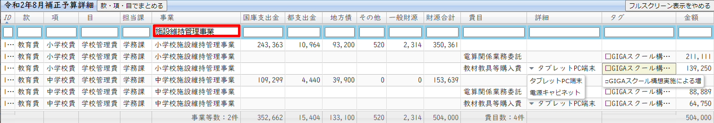
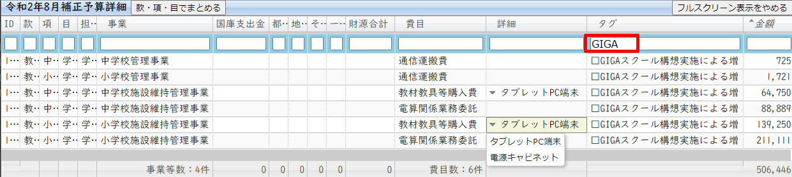
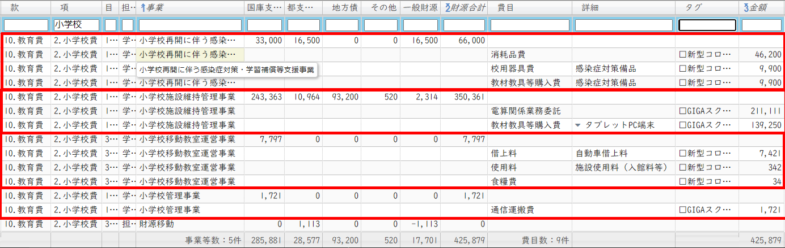
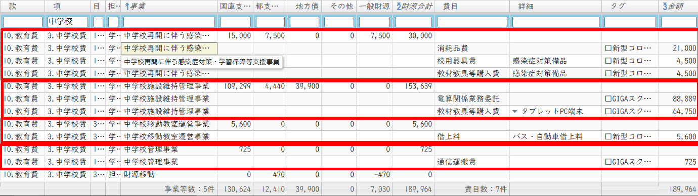
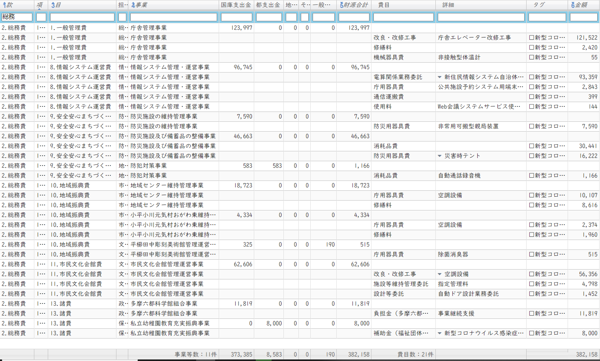
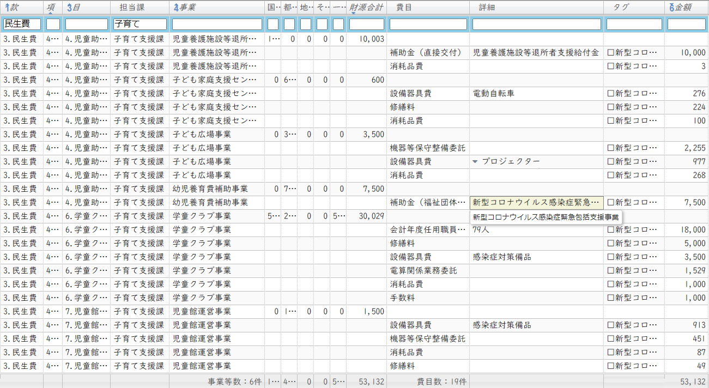
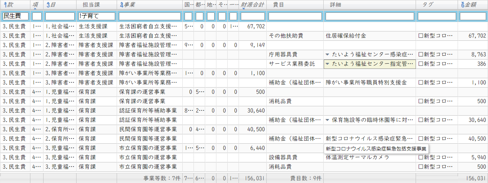
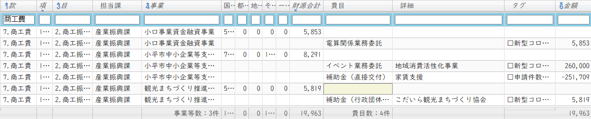

# 議案第44号 令和2年度小平市一般会計補正予算（第4号）
（作成中です）

<i class="fa fa-gavel" aria-hidden="true"></i> 総務委員会付託

<fieldset class="point">
  <legend>
    <h2 class="point"> ポイント </h2>
  </legend>
  
✔ 総額約16億円 ＝ 国12億 ＋ 都2億 ＋ 小平市 ( 市債1.5億 ＋ 一般財源0.5億円 )

  
✔ GIGAスクール事業に約 5.1 億円

  
✔ キャッシュレス購入へのポイント付与事業に約 2.6 億円

  
✔ 昭和病院の財政支援に約 1.8 億円

  
✔ 住居確保給付金事業に約 0.7 億円

  
✔ エレベータ約1.8億、空調約0.7億、予約シス約0.5億など不急事業に計約3.5億円

  
✔ その他、保育施設の感染症対策、災害備蓄、コミタク事業支援、学童クラブ支援等

</fieldset>

<fieldset class="sanpi">
  <legend>
    <h2 class="sanpi">❌ 私（安竹洋平）の判断：大反対 </h2>
  </legend>
  
❌ 評価できる部分もあるものの、それ以外の問題があまりにも大きいため反対

  
⭕️ 🏠セーフティネットとしての住居確保給付金増額分に、一般財源も投じている

  
⭕️ 💻GIGAスクール構想の実現に向けて市債を投じる投資姿勢は良い

  
⭕️ 👶子育て支援課の事業内容はまっとう、不足はあるかもしれないが無駄はない

  
❌ 不急の事業に巨費を投じており、臨時交付金という稀有の機会を無駄にしている

  
❌ オンライン化の推進など、将来に向けた一貫性のある投資が行われていない

  
❌ 次回臨時交付金に向けても、市のビジョンを示す必要があるが、片鱗すら見えない

</fieldset>

## 概要
コロナ禍に対応するため国から支給される「新型コロナ感染症対応地方創生臨時交付金」を受けた補正予算です。小平市への交付金は約12億円あり、その全額を活用します。それ以外に都から2億円。小平市自身の支出は、まず、GIGAスクール構想の実現に向けて教員用タブレットやネット環境を設備を整備する目的で、市債を約1億5千万円計上しています。さらに一般財源からはきっかり5千万円を支出し、これはセーフティネットとしての住居確保給付金の増額と、小中学校の新型コロナウイルス感染症対策等に使用されます。総額16億円という、自由度の高い予算として巨額の内容になっています。

市長報告（クリックで開きます）

> 今回の補正予算は、本年6月12日に成立した国の令和2年度補正予算第2号における新型コロナウイルス感染症対応地方創生臨時交付金など、国や東京都の補正予算等を最大限活用し、事業継続支援や生活支援に取り組むとともに、新しい生活様式への対応を図るための経費等を計上するものです。なお、年度内の完了が見込めない事業につきましては、繰越明許費を設定いたします｡
>
> 歳出の主な内容ですが、事業継続支援では、地域消費活性化事業として、キャッシュレス購入へのポイント付与を実施するとともに、こだいら観光まちづくり協会による市内消費促進事業を補助いたします。
>
>また、国の慰労金の対象とならない障がい事業所等の従事者や、臨時休園により利用者負担額を軽減した認証保育所等を支援するとともに、多摩六都科学館､公立昭和病院、コミュニティバス、コミュニテイタクシー、市民総合体育館指定管理者に対する事業継続支援を実施いたします｡
>
>生活支援では､利用月数が伸びている住居確保給付金を増額し、児童養護施設等退所者支援給付金を計上するほか、育児パッケージの追加配付や、小･中学校において夏季休業を短縮する期間に学習指導サポーターを追加配置いたします。
>
>新しい生活様式への対応では、3密対策として､公共施設予約システムの利用対象施設の拡大、証明書のコンビニ交付サービス導入に向けたシステム構築､都市計画、建築行政、道路管理にかかる地図情報のインターネット公開に取り､組むとともに、小・中学校移動教室で使用するバスの増配や、4月から6月までの乳幼児健康診査の集団検診が実施できなかった方について個別検診へ切り替えて実施してまいります。
>
>そのほか、非接触を図るため、ルネこだいらの入口の自動ドア化や、地域センター等のトイレ手洗い自動水栓化の改修を行います。
>
>また、GIGAスクール構想の実現に向けて、ネットワークの構築や、電源キャビネット、児童・生徒の自然増や教員分のタブレットPCの整備等にかかる経費を計上いたします。
>
>新型コロナウイルス感染拡大の防止として、私立幼稚園や保育園等のほか、小・中学校、学童クラブ､障害者福祉施設、図書館、公民館などの施設における衛生用品や、感染防止のための備品にかかる経費等を計上いたします｡
>
>また、換気設備の改善として、本庁舎、及び健康センターエレベーターを改修するとともに、本庁舎、地域センター、元気村おがわ東、市民総合体育館、ルネこだいらの空調設備や網戸改修などの換気対策を実施いたします。
>
>補正予算の規模といたしましては、歳入歳出それぞれ16億1千194万8千円を増額し、歳入歳出予算の総額をそれぞれ924億7千637万9千円とするものです。
>
>財源構成といたしましては、事業の実施に伴い、国、都支出金を増額するとともに、寄附金、地方債、及び財政調整基金からの繰入金で対応いたします｡

## 解説　{{#include ../partials/yasutake-speak.md:1}}

#### 今まででもっともひどい予算！😩
私が小平市議会議員になって1年4か月。今まで最もひどい予算です。今回は臨時交付金が約12億円と、自由に巨額の予算が使えるめったにない機会でした。「コロナ禍に対応する」という名目で市をアップグレードするまたとないチャンスでした。しかし、市はこの千載一遇のチャンスを無駄にしました。現状でも十分に使えるエレベーターの改修や、ルネこだいら等の空調設備改修、自動ドア設置、公共施設予約システム、トイレの手洗い自動水洗化、公園遊具の抗菌処理、ホームページリニューアルなど、不急の事業に巨費が投じられることになります。一人会派の会と政和会が反対し、政和会からは組み替え動議も出されましたが、それ以外の会派が賛成したため可決されてしまいました。後ほど記載しますが、小平市ではすべての案が可決されてしまいます。

##### 不急事業に約3億5千万円 💸

ざっと確認した限りで、補正予算のうち、不急/もしくはアイデア次第で費用削減が可能と思われる事業を金額順に並べました。総額は約3億5千万円です。すべて臨時交付金を100%充当しており市からの支出はないものの、せっかく他の事業に使える分がそれだけ減っているということになります。

<table class="simple">
  <thead>
    <tr>
      <td>款</td>
      <td>項</td>
      <td>目</td>
      <td>事業内容</td>
      <td>金額 （千円）</td>
      <td>臨時 交付金 充当率</td>
    </tr>
  </thead>
  <tbody>
    <tr>
      <td>2</td>
      <td>1</td>
      <td>1</td>
      <td>本庁舎エレべーター改修 (正面1号機、通用口 4号機）</td>
      <td>121,522 </td>
      <td>100%</td>
    </tr>
    <tr>
      <td>4</td>
      <td>1</td>
      <td>1</td>
      <td>健康センターエレベーター改修</td>
      <td>56,937 </td>
      <td>100%</td>
    </tr>
    <tr>
      <td>2</td>
      <td>1</td>
      <td>11</td>
      <td>ルネこだいら空調設備改修</td>
      <td>48,756 </td>
      <td>100%</td>
    </tr>
    <tr>
      <td>2</td>
      <td>1</td>
      <td>8</td>
      <td>公共施設予約システム利用対象施設拡大  (地域センター、ルネこだいらを追加し再構築）</td>
      <td>48,672 </td>
      <td>100%</td>
    </tr>
    <tr>
      <td>8</td>
      <td>3</td>
      <td>2</td>
      <td>公園遊具の感染症対策</td>
      <td>32,258 </td>
      <td>100%</td>
    </tr>
    <tr>
      <td>2</td>
      <td>1</td>
      <td>10</td>
      <td>地域センター換気対策等</td>
      <td>11,715 </td>
      <td>100%</td>
    </tr>
    <tr>
      <td>2</td>
      <td>1</td>
      <td>11</td>
      <td>ルネこだいらの入口の自動ドア化</td>
      <td>9,052 </td>
      <td>100%</td>
    </tr>
    <tr>
      <td>2</td>
      <td>1</td>
      <td>10</td>
      <td>地域センターのトイレ手洗い自動水栓化</td>
      <td>7,008 </td>
      <td>100%</td>
    </tr>
    <tr>
      <td>2</td>
      <td>1</td>
      <td>11</td>
      <td>「ルネこだいら」のホームページリニューアル</td>
      <td>4,798 </td>
      <td>100%</td>
    </tr>
    <tr>
      <td>2</td>
      <td>1</td>
      <td>10</td>
      <td>小平元気村おがわ東空調設備改修</td>
      <td>2,374 </td>
      <td>100%</td>
    </tr>
    <tr>
      <td>3</td>
      <td>1</td>
      <td>2</td>
      <td>障害者福祉施設（あおぞら） トイレ手洗い自動水栓化</td>
      <td>2,097 </td>
      <td>100%</td>
    </tr>
    <tr>
      <td>2</td>
      <td>1</td>
      <td>10</td>
      <td>元気村おがわ東トイレ手洗い自動水栓化</td>
      <td>1,960 </td>
      <td>100%</td>
    </tr>
    <tr>
      <td></td>
      <td></td>
      <td></td>
      <td>合計</td>
      <td>347,149 </td>
      <td>-</td>
    </tr>
  </tbody>
</table>

#### この時期に使用頻度の低いエレベーターや自動ドアに巨費を投じるのは驚き😨

「地方創生臨時交付金」も、天から降ってくるわけではなく、原資は私たちの税金です。コロナ禍で苦しい中、利用頻度の低いエレベーターや自動ドアに税金の多くを投じてほしいなどと、いったい誰が願うでしょうか？空調設備に関しても、感染者数や重症者数がほとんど増えていない状況でそこまでお金をかけることとは思えません。何をどうすればこのような予算が出てくるのか・・・。

#### イチバンの原因は、市長。職員に責任を取らせるようではダメ

なぜこのようなひどい予算案になってしまうのか。一番大きな原因は、市長の不作為（やる気なし）であると私は判断しています。市長は人柄が気さくで、正直なところ私も嫌いにはなれません。しかし、いかんせん、やる気がない。やる気がないために、市長がやるべき仕事を職員が担っています。どんなに優秀であっても、職員は市民に選ばれた存在ではないため、重大な決断はできません。4年間の任期もなく、定年まで働き続けるわけですから、無難な案を採用するバイアスがあります。結果として、各部署に要望を聞き、それをそのまま束ねて予算を立てるというような事態になります。つまり、職員に責任を持たせると、客観的に無難な方向に流れるというのは世の常なのです。その結果、各部署の要望をそのまま取り入れたような予算ができあがり、抜本的な改革は行われず、先細りになるばかりです。

本来は、<strong>自由になる金額が大きくなるほど、市長の責任で決断しなければならないのです。</strong>今がその時でしたが、大失敗しています。市長は役割を担えていません。予算は通ってしまいましたので仕方がありません。次回の臨時交付金を無駄にしないためにも、9月の一般質問では、市長が全責任をもって事業に取り組む必要があることを訴える予定です。

私が考えている、今回のような予算案が出てきてしまう背景をチャートにしてみました。

<div class="mxgraph" style="max-width:100%;border:1px solid transparent;" data-mxgraph="{&quot;highlight&quot;:&quot;#0000ff&quot;,&quot;nav&quot;:true,&quot;zoom&quot;:1.2,&quot;resize&quot;:true,&quot;toolbar&quot;:&quot;zoom layers lightbox&quot;,&quot;edit&quot;:&quot;_blank&quot;,&quot;xml&quot;:&quot;&lt;mxfile host=\&quot;2a10f42a-a574-4a8e-a281-bb6f86ff300f\&quot; modified=\&quot;2020-08-23T16:12:12.421Z\&quot; agent=\&quot;5.0 (Windows NT 10.0; Win64; x64) AppleWebKit/537.36 (KHTML, like Gecko) Code/1.48.1 Chrome/78.0.3904.130 Electron/7.3.2 Safari/537.36\&quot; etag=\&quot;TDQClBC77wRxENRbrCl4\&quot; version=\&quot;13.1.3\&quot;&gt;&lt;diagram id=\&quot;6hGFLwfOUW9BJ-s0fimq\&quot; name=\&quot;Page-1\&quot;&gt;&lt;mxGraphModel dx=\&quot;762\&quot; dy=\&quot;446\&quot; grid=\&quot;1\&quot; gridSize=\&quot;10\&quot; guides=\&quot;1\&quot; tooltips=\&quot;1\&quot; connect=\&quot;1\&quot; arrows=\&quot;1\&quot; fold=\&quot;1\&quot; page=\&quot;1\&quot; pageScale=\&quot;1\&quot; pageWidth=\&quot;827\&quot; pageHeight=\&quot;1169\&quot; math=\&quot;0\&quot; shadow=\&quot;0\&quot;&gt;&lt;root&gt;&lt;mxCell id=\&quot;0\&quot;/&gt;&lt;mxCell id=\&quot;1\&quot; parent=\&quot;0\&quot;/&gt;&lt;mxCell id=\&quot;9\&quot; style=\&quot;edgeStyle=orthogonalEdgeStyle;rounded=0;orthogonalLoop=1;jettySize=auto;html=1;exitX=0.5;exitY=1;exitDx=0;exitDy=0;entryX=0.5;entryY=0;entryDx=0;entryDy=0;\&quot; edge=\&quot;1\&quot; parent=\&quot;1\&quot; source=\&quot;2\&quot; target=\&quot;3\&quot;&gt;&lt;mxGeometry relative=\&quot;1\&quot; as=\&quot;geometry\&quot;/&gt;&lt;/mxCell&gt;&lt;mxCell id=\&quot;2\&quot; value=\&quot;市長にやる気がない&amp;lt;br&amp;gt;責任をとる気がない\&quot; style=\&quot;rounded=0;whiteSpace=wrap;html=1;gradientColor=#7ea6e0;fillColor=#dae8fc;strokeColor=#6c8ebf;fontColor=#000000;fontStyle=1\&quot; vertex=\&quot;1\&quot; parent=\&quot;1\&quot;&gt;&lt;mxGeometry x=\&quot;40\&quot; y=\&quot;40\&quot; width=\&quot;120\&quot; height=\&quot;60\&quot; as=\&quot;geometry\&quot;/&gt;&lt;/mxCell&gt;&lt;mxCell id=\&quot;25\&quot; style=\&quot;edgeStyle=orthogonalEdgeStyle;rounded=0;orthogonalLoop=1;jettySize=auto;html=1;exitX=1;exitY=0.5;exitDx=0;exitDy=0;\&quot; edge=\&quot;1\&quot; parent=\&quot;1\&quot; source=\&quot;3\&quot; target=\&quot;4\&quot;&gt;&lt;mxGeometry relative=\&quot;1\&quot; as=\&quot;geometry\&quot;/&gt;&lt;/mxCell&gt;&lt;mxCell id=\&quot;3\&quot; value=\&quot;まちをどうするか&amp;lt;br&amp;gt;プランできない&amp;lt;br&amp;gt;ビジョンがない\&quot; style=\&quot;rounded=0;whiteSpace=wrap;html=1;fillColor=none;\&quot; vertex=\&quot;1\&quot; parent=\&quot;1\&quot;&gt;&lt;mxGeometry x=\&quot;40\&quot; y=\&quot;130\&quot; width=\&quot;120\&quot; height=\&quot;60\&quot; as=\&quot;geometry\&quot;/&gt;&lt;/mxCell&gt;&lt;mxCell id=\&quot;19\&quot; style=\&quot;edgeStyle=orthogonalEdgeStyle;rounded=0;orthogonalLoop=1;jettySize=auto;html=1;exitX=0.5;exitY=1;exitDx=0;exitDy=0;entryX=0.5;entryY=0;entryDx=0;entryDy=0;\&quot; edge=\&quot;1\&quot; parent=\&quot;1\&quot; source=\&quot;4\&quot; target=\&quot;5\&quot;&gt;&lt;mxGeometry relative=\&quot;1\&quot; as=\&quot;geometry\&quot;/&gt;&lt;/mxCell&gt;&lt;mxCell id=\&quot;4\&quot; value=\&quot;市の職員が&amp;lt;br&amp;gt;プランをつくり&amp;lt;br&amp;gt;予算を立てなければ&amp;lt;br&amp;gt;ならない\&quot; style=\&quot;rounded=0;whiteSpace=wrap;html=1;fillColor=none;\&quot; vertex=\&quot;1\&quot; parent=\&quot;1\&quot;&gt;&lt;mxGeometry x=\&quot;190\&quot; y=\&quot;130\&quot; width=\&quot;120\&quot; height=\&quot;60\&quot; as=\&quot;geometry\&quot;/&gt;&lt;/mxCell&gt;&lt;mxCell id=\&quot;20\&quot; style=\&quot;edgeStyle=orthogonalEdgeStyle;rounded=0;orthogonalLoop=1;jettySize=auto;html=1;exitX=0.5;exitY=1;exitDx=0;exitDy=0;entryX=0.5;entryY=0;entryDx=0;entryDy=0;\&quot; edge=\&quot;1\&quot; parent=\&quot;1\&quot; source=\&quot;5\&quot; target=\&quot;13\&quot;&gt;&lt;mxGeometry relative=\&quot;1\&quot; as=\&quot;geometry\&quot;/&gt;&lt;/mxCell&gt;&lt;mxCell id=\&quot;5\&quot; value=\&quot;職員は市民に選ばれたわけではないので&amp;lt;br&amp;gt;責任を伴うプランは作成できない\&quot; style=\&quot;rounded=0;whiteSpace=wrap;html=1;fillColor=none;\&quot; vertex=\&quot;1\&quot; parent=\&quot;1\&quot;&gt;&lt;mxGeometry x=\&quot;190\&quot; y=\&quot;220\&quot; width=\&quot;120\&quot; height=\&quot;60\&quot; as=\&quot;geometry\&quot;/&gt;&lt;/mxCell&gt;&lt;mxCell id=\&quot;21\&quot; style=\&quot;edgeStyle=orthogonalEdgeStyle;rounded=0;orthogonalLoop=1;jettySize=auto;html=1;exitX=1;exitY=0.5;exitDx=0;exitDy=0;\&quot; edge=\&quot;1\&quot; parent=\&quot;1\&quot; source=\&quot;13\&quot; target=\&quot;17\&quot;&gt;&lt;mxGeometry relative=\&quot;1\&quot; as=\&quot;geometry\&quot;&gt;&lt;mxPoint x=\&quot;330\&quot; y=\&quot;340\&quot; as=\&quot;targetPoint\&quot;/&gt;&lt;/mxGeometry&gt;&lt;/mxCell&gt;&lt;mxCell id=\&quot;13\&quot; value=\&quot;各部署の要望を&amp;lt;br&amp;gt;まとめて予算をつけるといった無難な選択しかできない\&quot; style=\&quot;rounded=0;whiteSpace=wrap;html=1;fillColor=none;\&quot; vertex=\&quot;1\&quot; parent=\&quot;1\&quot;&gt;&lt;mxGeometry x=\&quot;190\&quot; y=\&quot;310\&quot; width=\&quot;120\&quot; height=\&quot;60\&quot; as=\&quot;geometry\&quot;/&gt;&lt;/mxCell&gt;&lt;mxCell id=\&quot;16\&quot; value=\&quot;愛嬌があるため問題視されにくい。&amp;lt;br&amp;gt;人柄がよくても、職責をまっとう&amp;lt;br&amp;gt;できなければ意味がない。\&quot; style=\&quot;text;html=1;strokeColor=none;fillColor=none;align=left;verticalAlign=middle;whiteSpace=wrap;rounded=0;\&quot; vertex=\&quot;1\&quot; parent=\&quot;1\&quot;&gt;&lt;mxGeometry x=\&quot;170\&quot; y=\&quot;35\&quot; width=\&quot;200\&quot; height=\&quot;70\&quot; as=\&quot;geometry\&quot;/&gt;&lt;/mxCell&gt;&lt;mxCell id=\&quot;28\&quot; style=\&quot;edgeStyle=orthogonalEdgeStyle;rounded=0;orthogonalLoop=1;jettySize=auto;html=1;exitX=0.5;exitY=1;exitDx=0;exitDy=0;entryX=0.5;entryY=0;entryDx=0;entryDy=0;fontColor=#000000;\&quot; edge=\&quot;1\&quot; parent=\&quot;1\&quot; source=\&quot;17\&quot; target=\&quot;26\&quot;&gt;&lt;mxGeometry relative=\&quot;1\&quot; as=\&quot;geometry\&quot;/&gt;&lt;/mxCell&gt;&lt;mxCell id=\&quot;17\&quot; value=\&quot;将来につながるオンライン化の推進など大胆な施策に有効な投資がなされない\&quot; style=\&quot;rounded=0;whiteSpace=wrap;html=1;fillColor=none;\&quot; vertex=\&quot;1\&quot; parent=\&quot;1\&quot;&gt;&lt;mxGeometry x=\&quot;340\&quot; y=\&quot;310\&quot; width=\&quot;120\&quot; height=\&quot;60\&quot; as=\&quot;geometry\&quot;/&gt;&lt;/mxCell&gt;&lt;mxCell id=\&quot;26\&quot; value=\&quot;市民生活が&amp;lt;br&amp;gt;グレードアップ&amp;lt;br&amp;gt;していかない&amp;lt;br&amp;gt;閉塞感・停滞感\&quot; style=\&quot;rounded=0;whiteSpace=wrap;html=1;perimeterSpacing=1;strokeWidth=2;fillColor=#e6d0de;strokeColor=#996185;gradientColor=#d5739d;fontColor=#000000;fontStyle=1\&quot; vertex=\&quot;1\&quot; parent=\&quot;1\&quot;&gt;&lt;mxGeometry x=\&quot;330\&quot; y=\&quot;410\&quot; width=\&quot;140\&quot; height=\&quot;80\&quot; as=\&quot;geometry\&quot;/&gt;&lt;/mxCell&gt;&lt;mxCell id=\&quot;29\&quot; value=\&quot;やる気のある職員が提案しても&amp;lt;br&amp;gt;責任が生じるものは通りにくい。&amp;lt;br&amp;gt;働き甲斐がなくなり、つらい立場に。\&quot; style=\&quot;text;html=1;strokeColor=none;fillColor=none;align=left;verticalAlign=middle;whiteSpace=wrap;rounded=0;\&quot; vertex=\&quot;1\&quot; parent=\&quot;1\&quot;&gt;&lt;mxGeometry x=\&quot;320\&quot; y=\&quot;235\&quot; width=\&quot;210\&quot; height=\&quot;30\&quot; as=\&quot;geometry\&quot;/&gt;&lt;/mxCell&gt;&lt;mxCell id=\&quot;47\&quot; style=\&quot;edgeStyle=none;rounded=0;orthogonalLoop=1;jettySize=auto;html=1;fontColor=#FFFFFF;\&quot; edge=\&quot;1\&quot; parent=\&quot;1\&quot; source=\&quot;34\&quot;&gt;&lt;mxGeometry relative=\&quot;1\&quot; as=\&quot;geometry\&quot;&gt;&lt;mxPoint x=\&quot;400\&quot; y=\&quot;220\&quot; as=\&quot;targetPoint\&quot;/&gt;&lt;/mxGeometry&gt;&lt;/mxCell&gt;&lt;mxCell id=\&quot;34\&quot; value=\&quot;&amp;lt;font color=&amp;quot;#000000&amp;quot;&amp;gt;&amp;lt;span style=&amp;quot;font-size: 12px ; font-style: normal ; font-weight: 400 ; letter-spacing: normal ; text-indent: 0px ; text-transform: none ; word-spacing: 0px ; font-family: &amp;amp;#34;helvetica&amp;amp;#34; ; float: none ; display: inline&amp;quot;&amp;gt;責任を取る必要があると&amp;lt;br&amp;gt;キャリアに影響して損をする。&amp;lt;/span&amp;gt;&amp;lt;br style=&amp;quot;font-size: 12px ; font-style: normal ; font-weight: 400 ; letter-spacing: normal ; text-indent: 0px ; text-transform: none ; word-spacing: 0px ; font-family: &amp;amp;#34;helvetica&amp;amp;#34;&amp;quot;&amp;gt;&amp;lt;span style=&amp;quot;font-size: 12px ; font-style: normal ; font-weight: 400 ; letter-spacing: normal ; text-indent: 0px ; text-transform: none ; word-spacing: 0px ; font-family: &amp;amp;#34;helvetica&amp;amp;#34; ; float: none ; display: inline&amp;quot;&amp;gt;　なるべくあたりさわりの&amp;lt;/span&amp;gt;&amp;lt;br style=&amp;quot;font-size: 12px ; font-style: normal ; font-weight: 400 ; letter-spacing: normal ; text-indent: 0px ; text-transform: none ; word-spacing: 0px ; font-family: &amp;amp;#34;helvetica&amp;amp;#34;&amp;quot;&amp;gt;&amp;lt;/font&amp;gt;&amp;lt;span style=&amp;quot;font-size: 12px ; font-style: normal ; font-weight: 400 ; letter-spacing: normal ; text-indent: 0px ; text-transform: none ; word-spacing: 0px ; font-family: &amp;amp;#34;helvetica&amp;amp;#34; ; float: none ; display: inline&amp;quot;&amp;gt;&amp;lt;font color=&amp;quot;#000000&amp;quot;&amp;gt;ないプランを作ろう！&amp;lt;/font&amp;gt;&amp;lt;br&amp;gt;&amp;lt;/span&amp;gt;\&quot; style=\&quot;ellipse;shape=cloud;whiteSpace=wrap;html=1;strokeWidth=2;align=center;fillColor=none;\&quot; vertex=\&quot;1\&quot; parent=\&quot;1\&quot;&gt;&lt;mxGeometry x=\&quot;340\&quot; y=\&quot;90\&quot; width=\&quot;220\&quot; height=\&quot;120\&quot; as=\&quot;geometry\&quot;/&gt;&lt;/mxCell&gt;&lt;mxCell id=\&quot;38\&quot; value=\&quot;\&quot; style=\&quot;ellipse;whiteSpace=wrap;html=1;aspect=fixed;strokeWidth=2;fontColor=#000000;align=center;\&quot; vertex=\&quot;1\&quot; parent=\&quot;1\&quot;&gt;&lt;mxGeometry x=\&quot;330\&quot; y=\&quot;140\&quot; width=\&quot;20\&quot; height=\&quot;20\&quot; as=\&quot;geometry\&quot;/&gt;&lt;/mxCell&gt;&lt;mxCell id=\&quot;39\&quot; value=\&quot;\&quot; style=\&quot;ellipse;whiteSpace=wrap;html=1;aspect=fixed;strokeWidth=2;fontColor=#000000;align=center;\&quot; vertex=\&quot;1\&quot; parent=\&quot;1\&quot;&gt;&lt;mxGeometry x=\&quot;320\&quot; y=\&quot;160\&quot; width=\&quot;10\&quot; height=\&quot;10\&quot; as=\&quot;geometry\&quot;/&gt;&lt;/mxCell&gt;&lt;mxCell id=\&quot;40\&quot; value=\&quot;士気低下のバイアス\&quot; style=\&quot;text;html=1;strokeColor=none;fillColor=none;align=left;verticalAlign=middle;whiteSpace=wrap;rounded=0;\&quot; vertex=\&quot;1\&quot; parent=\&quot;1\&quot;&gt;&lt;mxGeometry x=\&quot;450\&quot; y=\&quot;80\&quot; width=\&quot;130\&quot; height=\&quot;20\&quot; as=\&quot;geometry\&quot;/&gt;&lt;/mxCell&gt;&lt;mxCell id=\&quot;42\&quot; value=\&quot;START\&quot; style=\&quot;text;html=1;strokeColor=none;fillColor=none;align=left;verticalAlign=middle;whiteSpace=wrap;rounded=0;fontStyle=1;fontColor=#FF0000;\&quot; vertex=\&quot;1\&quot; parent=\&quot;1\&quot;&gt;&lt;mxGeometry x=\&quot;40\&quot; y=\&quot;20\&quot; width=\&quot;130\&quot; height=\&quot;20\&quot; as=\&quot;geometry\&quot;/&gt;&lt;/mxCell&gt;&lt;mxCell id=\&quot;43\&quot; value=\&quot;GOAL\&quot; style=\&quot;text;html=1;strokeColor=none;fillColor=none;align=left;verticalAlign=middle;whiteSpace=wrap;rounded=0;fontStyle=1;fontColor=#FF0000;\&quot; vertex=\&quot;1\&quot; parent=\&quot;1\&quot;&gt;&lt;mxGeometry x=\&quot;330\&quot; y=\&quot;390\&quot; width=\&quot;130\&quot; height=\&quot;20\&quot; as=\&quot;geometry\&quot;/&gt;&lt;/mxCell&gt;&lt;/root&gt;&lt;/mxGraphModel&gt;&lt;/diagram&gt;&lt;/mxfile&gt;&quot;}">

#### もう一つの原因は、議会の機能不全 💤🏛️💤

さらなる問題が、市の行政チェックを行う私たち議員の方にあります。一人会派の会は当然ながら全員が今回の予算に反対しました。しかし私たちだけでは人数が足りず可決される可能性が高かったため、今回は自民党から提案された組み替え動議にも乗りました。それでも、他の会派が全て賛成したため、この予算は通ってしまいました。

最近の小平市議会は、どんなに議案の内容に問題があっても、すべての案が可決されてしまいます。チェック機能が一切働いていません。各議員は選挙で選ばれていますから議決結果は受け入れますが、私から見ると小平市議会は完全に機能不全を起こしています。

##### 反対意見を出しながら、決議では賛成に回る与党議員たち

また特におかしなことがあります。いわゆる与党と言われている、フォーラム小平、共産党、生活者ネットワーク、そして与党とは見なされていない公明党も、意見表明の場では、議案に反対するかのようなコメントをすることが良くあります。私も当初、そうしたコメントを聞いて「おや、与党会派でも議案に反対することがあるのかな？」と少しだけ思うことがありました。しかし、なんのことはない。結局、議決では賛成に回るのです。これは毎度のことで、今はもう慣れています。

与党の会派は、選挙で市長推薦など得ているのですから、もともと議案には最初から反対できないのです。議会が担うべきチェック機能のことなど、何も気にならないようです。なお、与党とみなされていない公明党会派に関しては、なぜあれだけの反対意見を出しておきながら毎回賛成に回るのか、動機の部分からまったく理解できません。

結局賛成するのに、さも反対するかのようなコメントをするのは、<strong>有権者に言い訳をするためなのかもしれない</strong>と、私は勝手に思っています。

なお、小平市議会ではいわゆる野党とされる政和会も、国政からの圧力で意見を変えざるを得ないことがあると、風の噂に聞きます。そうであれば本当に情けない。いつも思うのは、こうした状態では、議員本人も仕事をしていて苦しい場面が多いのではないでしょうか。

やはり市政は、一人会派の会議員のように、基本的に無所属で、内向きの縛りが一切ない状態で自由に発言できることが重要だと実感します。

##### 時間の無駄なので、ムダに長い反対意見表明はやめてほしい⏱

さて意見表明は自由ですけれども、どうせ最後には賛成に回ることが決まっているなら、少なくともコメントだけは短くしてもらいたいです。長々と反対のコメントをするのは、はっきりいって言い訳がましいですし、その場に出席している多くの人、特に職員の貴重な時間を奪い、市民のために仕事をする時間を奪っていることを気にして欲しいものです。

##### 反対する理由は、行政側との緊張感を保ち、案の内容をブラッシュアップするため

今回、まちづくり市民こだいらの水口議員は「議案を可決させて速やかに施策に移行しなければ市民が不利益を被る」といった趣旨で議案に賛成しました。しかしそれは間違えています。今回はそこまで緊急性のあるものもありませんし（専決処分にもなっていませんし）、否決されても執行部はすぐに対案を出してきます。彼らも否決される可能性を想定しています。そういう仕組みだからです。良くない議案については反対し、より良い内容にブラッシュアップしていかなくてはなりません。議会は行政の暴走や怠慢を防ぐためのフィードバック装置としての役割があります。正当な理由なくそれを曲げるのであれば、役割を放棄するということになります。水口議員は、改正案が出るまでに数か月かかると政和会の議員から聞いた、ということだそうですが、もし仮にそのようなことが起こるとしたら、それこそ執行部の大問題です。「まさか否決されることは一切想定してなかった！」などあり得ないからです。

もちろん単に反対ばかりしていれば良いわけではなく、議員から対案を出していく必要もあります。一般質問では具体的な案を提示するように心掛けています。また、市長にエレベーター内でお会いした時などに提案もしています。9月の一般質問では次回の臨時交付金に向けての提案を行います。

#### 小平市の現状

・・・以上、私が認識している小平市の現状を、一枚の絵に描いてみました↓  
ちょっと文字が多いのですが・・・（クリック/タップで拡大します）  

#### 小平市の理想像

理想はこちらのような状況です↓  
このような小平になってほしい。少なくとも一人会派の会にいる議員は、このような理想を抱いて仕事をしていると感じます。  

### 👁️‍🗨️ふらっとビューア（予算決算） ver 0.1
さて、小平市の予算書はとても読みにくく、検索、抽出、並べ替えといったデータの操作ができないため、それを可能にするふらっとビューア（予算決算）をつくりました。
歳出予算に関して、様々な側面から確認することができます。（＊金額の単位は「千円」です）。

このビューアの使い方解説とともに、以下で予算の詳細を見ていきたいと思います。

<!--
- 『款・項・目でまとめない』ボタンを押すと、費目一覧を表示できます。
並べ替え・フィルターもあります。
-->

  

    <label>令和2年8月補正予算詳細</label>
    <button id="grouping">款・項・目でまとめない</button>
    <button id="fullscreen">フルスクリーンで表示する</button>
  

  

<!-- slickgridはレガシーなのでwebpackなど使えず。 -->
<link rel="stylesheet" href="../css-each/slick.grid.css" type="text/css"/>
<link rel="stylesheet" href="../css-each/jquery-ui.css" type="text/css"/>
<link rel="stylesheet" href="../css-each/slick.pager.css" type="text/css"/>
<link rel="stylesheet" href="../css-each/examples.css" type="text/css"/>

[4号補正予算補足.xls](4号補正予算補足.xlsx)

#### 🕵補正予算を分析する

歳入を金額順にグラフにすると↑このようになります。国からの支出金が大半で、小平市の財布から出しているのは、1.33億円の市債の部分と、財政調整基金の繰入金（基金繰入金）5千万円の部分です。

歳出について、財源を含めて金額順に並べました。今回最も歳出が大きいのは教育費の約6億5千万円で、そのうち約5億円が、GIGAスクール構想実現のための経費です。教育費の大半が国庫支出金で賄われていますが、市債1.33億円と、一般財源からも2,470万円が投じられています。総務費、衛生費、民生費と続きます。詳細は順次以下で説明します。

なお、年度内の完了が見込めない分として約2.2億円が繰越明許費に計上されます。

##### ☆ ふらっとビューアver0.1 でさらに詳細を見る ☆

さて突然ですが、ここからは、ふらっとビューアの使い方を😃タローと🐶ポチの会話形式にてお送りします。

🤔 市債1.33億円は全額GIGAスクールに使われているということだけれど、ふらっとビューアでもそれが調べられるの？

🐶 簡単だワン。次の図を見るワン。（クリック/タップで拡大表示します）  
  
まず、左上の方にある『款・項・目でまとめない』ボタンを押すと、図のように費用項目一覧が表示されるワン。そうしたら「地方債（市債）」のフィルタに「>0」を入れるワン。そうすることで、市債の金額が0より大きい事業、つまり「市債が使われている事業」を全て抽出できるワン。「小（中）学校施設維持管理事業」という事業名からはGIGAスクール関連ということは分からないけれど、今度はこの事業名でフィルタをかけると、GIGAスクール構想を進めるための事業だということが分かるワン。他にはヒットしないので、全額この事業に使われていることが分かるワン。

😲 なるほど。ところで最初にフィルタに入れた「>0」はどういう意味？

🐶 「0より大きい数値（だけ抽出せよ）」という意味だワン。数値を抽出する場合は、以下の記号が使えるワン。

<table class="simple">
<caption style="text-align:left;">数値列のフィルタで使用できる記号</caption>
<tr><th>記号</th><th>意味</th><th>例</th><th>例の意味</th></tr>
<tr><td>=</td><td>等しい</td><td>=123</td><td>123と等しいものだけ抽出</td></tr>
<tr><td>!=</td><td>等しくない</td><td>!=123</td><td>123と等しくないものだけ抽出</td></tr>
<tr><td>></td><td>より大きい</td><td>>123</td><td>123より大きいものだけ抽出</td></tr>
<tr><td>>=</td><td>以上</td><td>>=123</td><td>123以上のものだけ抽出</td></tr>
<tr><td><</td><td>より小さい</td><td><123</td><td>123より小さいものだけ抽出</td></tr>
<tr><td><=</td><td>以下</td><td><=123</td><td>123以下のものだけ抽出</td></tr>
</table>

😮 ふ～ん。ところで「小（中）学校施設維持管理事業」の詳細を見ると、「電算関係業務委託」と「教材教具等購入費」として、タブレットPC端末、電源キャビネットと書いてあるけれども、電算関係業務委託ってなに？タブレットの台数や用途は？

🐶 予算書のデータから分かるのはここまで。さらに詳しい内容は、別の資料を見たり理事者に確認したりする必要があるワン。今回は後述する質疑を参考にして欲しいワン。

😟 予算書にもう少し情報を追記してほしいところだね。GIGAスクール関係の他の費用は見られる？

🐶 タグのところにデータが入っていれば検索できるワン。今回は「GIGAスクール構想実施による増」というワードが設定されているので、すぐに検索できるワン  

😲 「通信運搬費」というのが新しくヒットしたね。これはたしか、お知らせを郵送したりする際の送料などのことね。

🐶 そうだワン。ちなみに文字列を抽出する場合は、以下の2つの記号が使えるワン。

<table class="simple">
<caption style="text-align:left;">文字列のフィルタで使用できる記号</caption>
<tr><th>記号</th><th>意味</th><th>例</th><th>例の意味</th></tr>
<tr><td>=</td><td>完全一致</td><td>=修繕料</td><td>「修繕料」と完全に一致するものだけ抽出</td></tr>
<tr><td>!=</td><td>不一致</td><td>!=修繕料</td><td>「修繕料」を含まないものだけ抽出</td></tr>
</table>

🐶 さて、市債の使い道は分かったので一旦置いておいて、今度はためしに費用の金額順に並べて「なにに大きなお金を使っているのか」を確認してみるワン。列のタイトルをクリックすると並べ替えができるので、「金額」を2回クリックして降順に並べ替えるワン。GIGAスクールについては先ほど調べたので、タグのフィルターに「!GIGA」と入力して、抽出しないようにしておくワン。  

🐶 ちなみに詳細のところに▼が記載されているものは、詳細が複数行に渡ることを示していて、マウスカーソルを乗せるかクリックすることで、その内容が表示されるワン。  

😐 ふむふむ。一番金額の多い2億6千万円の地域活性化事業って？

🐶 これは[補足資料](4号補正予算補足.xslx)に書いてあるのだけれど、キャッシュレス購入へのポイント付与事業だワン。市内店舗等でキャッシュレス購入を行った際に30%ポイント還元するという事業用の資金で、全額臨時交付金を充当するものだワン。

😐 あと、昭和病院の負担金が約1億8千万円もあるの？

🐶 新型コロナウイルス感染症の影響で昭和病院の収益が下がっていて、それを補填するための支出だそうだワン。何が起きてこの状況になっているのか、明確な答えが得られていないワン。これも全額臨時交付金の充当だわん。昭和病院に来院する人が減っているということなら全体の医療費が下がることで市民にはメリットも高いことだし、今後ずっと支払わなくてはならない契約なのかなどについても、安竹議員が今後精査する必要があると言っているワン。

😐 庁舎エレベーターの改修に1億2千万円と書いてあるけれども、故障でもしたの？

🐶 本庁舎のエレベーター2機分、コロナ禍に対応して、空調設備を新しくするための改修工事だそうだワン。故障しているわけでも、すぐにメンテナンスが必要なわけでもないワン。

😱 そんな不急のことに1億2千万円も支出しているの？！

🐶 それ以外にも不急のものへの支出が多いワン。もっとICT環境整備や、試験的なことに投資して欲しかったわん。将来に向けた投資ではなく、現状の改善、しかも不要なところにお金をかけていると、すごいスピードで先細りになると思うワン。

### それぞれの費用内訳

小学校費は、上記したGIGAスクールのタブレット以外に、小学校再開に伴う感染症対策・学習補償等支援事業、小学校移動教室運営事業（約780万円）があります。（赤枠は分類が分かりやすくなるよう後から付けました）。  

中学校費も、小学校費と同様です。移動教室のバス・自動車借上料が小学校の10分の1未満という点は気になります。  

保健体育費は、市民総合体育館の事業継続支援に約1,600万円と、給食の器具費です。

<strong>一般管理費</strong>は、庁舎エレベーターの改修工事に約1.2億円。

<strong>情報システム運営費</strong>は、電算関係業務委託関係に約9,700万円かかっており、内訳は以下の通りです。

<table class="simple">
<tr><th>事業</th><th>金額（円）</th></tr>
<tr><td>公共施設予約システム利用対象施設拡大  (地域センター、ルネこだいらを追加し再構築）</td><td>約4,900万円</td></tr>
<tr><td>証明書コンビニ交付に向けたシステム構築</td><td>約3,400万円</td></tr>
<tr><td>都市計画、建築行政、道路管理にかかる地図情報等の インターネット公開に向けたシステム構築</td><td>約1,400万円</td></tr>
</table>

今の時代、予約システムに約4,900万円も投じるとは、にわかには信じられません😨。詳しい人なら高校生でも1人で1万人規模くらいの予約システムをすぐ開発できる時代と思います。私に発注してくれるならアプリも対応して300万円程度で請け負いたい😋　いずれにしろ高額すぎると思います。

<strong>市民文化会館（ルネこだいら）費</strong>は、ルネこだいらの空調設備改修に約4,900万円、ルネこだいらの入口一か所を自動ドアにするために約900万円の支出です。コロナ禍に対応するということですが、空調設備にこんなにお金をかけず、皆にマスク😷	をしてもらっていれば良いのではないでしょうか・・・。ルネこだいらは文化的なイベントを行う際には良い施設ですが、毎年非常に多くのコストがかかっており、一回精査する必要があると考えています。

<strong>安全安心まちづくり費</strong>は、防災施設及び備蓄品の整備事業ということで、消耗品や、災害時テント⛺、応急給水等資機材倉朧、災害時ベッド、避難所用発電機等に合計約4,700万円かけています。コロナ禍というよりは災害用のような気がしますが、それでも臨時交付金が使えるのですね。そう考えるとかなり自由度が高い交付金なのではないかと思います。

<strong>地域振興費</strong>は、地域センターと元気村おがわ東の空調設備及び修繕費に合計約2,300万円かかっています。平櫛田中彫刻美術館の除菌消臭器に約52万円予算計上していますが、これについてはなぜか一般財源から19万円の支出となっているところも気になります。なぜ他と同様に、全額国庫で賄われなかったのでしょうか・・・。

<strong>民生費の子育て支援課分について</strong>は、至極まっとうな内容だと思います。学童クラブ指導員の負担増に応じた給与の支給や、児童養護施設等退所者支援給付金で、唯一ひっかかるとしたら、電動自転車くらいのものです。

<strong>民生費の子育て支援課以外の分について</strong>は、住居確保給付金に約6,800万円、市立及び民間の保育施設等臨時休園等に対する支援事業、包括支援事業に合計で約7,100万円、たいよう福祉センターとあおぞら福祉センターの庁用器具費に880万円というのは内容が気になるところですが、特に問題はなさそうです。

<strong>保険衛生費</strong>は、昭和病院の負担金が約1.8億円、健康センターのエレベーター改修が約5,700万円。先ほど述べたように、エレベーターの改修は不要不急ですし、昭和病院の負担金については精査が必要です。それ以外は特に問題のない予算だと思います。

<strong>商工費</strong>は約2千万円となっていますが、家賃支援で確保していた約2.5億円を地域消費活性化事業として「キャッシュレス購入へのポイント付与 (市内店舖等で30%ポイント還元）」2.6億円に組み替えています。実際は2.6億円の事業を始めるということです。どれくらいの効果が上がるのでしょうか。キャッシュレス購入にすぐ対応できない高齢者にはメリットがないという点も懸念事項です。

また、こだいら観光まちづくり協会への580万円（第2弾「モリモリ食べてモリあげよう」）も、どれだけ効果が上がるものなのか事後検証が必要なところです。そもそも第1弾の効果は上がったのでしょうか。

<strong>土木費</strong>は、コミュニティバス・タクシーの事業継続支援に合計約5,700万円、公園の修繕料として3,200万円が計上されています。人件費としての事業継続支援は必要と思いますが、事業従事している方々は休暇扱いになっていたのかが気になるところです🤔

また、公園修繕料は公園遊具の感染症対策ということですが、これは新型コロナ感染症に効果が認められているようなものではないそうです。一般的な抗菌塗料のようなものを遊具に塗装するということだそうで、コロナと関係ないどころか、まったく意味がないことです・・・。このようなことに3,200万円ものお金を使うのは、本当に驚くべきことです😨

以上が今回補正予算の概要です。この補正予算は総務委員会に付託されており、総務委員でない私は詳しい質問ができません。本会議である程度質問し、あとは総務委員である橋本久雄議員に託しました。回答の詳細が不明だったり、質問が抜けていた部分については、今後直接確認していきたいと思います。

## 主な質疑
{{#include ../partials/situgi_hanrei.md}}

### ＠ 本会議
<!--
<table class="qanda"><tr><td><i class="fa fa-question-circle hitori" aria-label="一人会派 その他議員による質問"></i></td><td>
（）
</td></tr></table>
<table class="qanda"><tr><td><i class="fa fa-question-circle-o" aria-label="その他議員による質問"></i></td><td>
</td></tr></table>
<table class="qanda"><tr><td><i class="fa fa-question-circle hitori yasutake" aria-label="安竹による質問"></i></td><td>
（安竹 洋平）
</td></tr></table>
-->

<table class="qanda"><tr><td><i class="fa fa-question-circle hitori" aria-label="一人会派 その他議員による質問"></i></td><td>
商工費は2千万円弱で全体の5%しかない。他市のように地域振興券等の施策を行わなかったかのはなぜか。（中江 美和）
</td></tr></table>

> 家賃支援の組み替えのため全体では計上が少ないがキャッシュレス決済によるポイント付与2.6億円を計上している。（余語 地域振興部長）

 
<table class="qanda"><tr><td><i class="fa fa-question-circle hitori" aria-label="一人会派 その他議員による質問"></i></td><td>
組み替えであり商工費での新規事業ではない。他市では補正予算に占める商工費の割合が、武蔵野市50%, 町田市60%、三鷹市50%と半分以上ある。他市の動向をどう捉えており、なぜ経済支援ができないのか。（中江 美和）
</td></tr></table>

> これまでは国や都の施策から漏れた部分に、家賃支援、感染拡大防止にかかる消毒液、マスク等小平市独自の支援をしてきており、今回はポイント還元を行っている。全体的な額では他市と比較していないが、市として適切に支援している。（余語）

 
<table class="qanda"><tr><td><i class="fa fa-question-circle hitori" aria-label="一人会派 その他議員による質問"></i></td><td>
繰越し明許費が2.2億円ある。緊急を要する予算であるにもかかわらず、次年度に繰り越すものを4つ挙げた理由と、完了の時期は。今年度中に事業完了が見込めないものはどうするか。（中江 美和）
</td></tr></table>

> 大型またはシステム改修に係る事業は年度内完了が難しい。完了時期は未定で契約後事業者との調整で決まる。いずれもwithコロナ時代に対応した事業。早い着手が必要。事業が完了しないものは繰り越す。交付金は繰り越せる。最大活用する。（津嶋 企画政策部長）

 
<table class="qanda"><tr><td><i class="fa fa-question-circle hitori" aria-label="一人会派 その他議員による質問"></i></td><td>
補正予算第2、第3号の執行率は。執行率が低い事業は。（伊藤 央）
</td></tr></table>

> 個々の執行率は把握できていない。家賃支援は利用が伸びなかったため（組み替えて）財源活用している。福祉関係の施設においても執行率は伸びていないが、減収がどれくらいかはレセプトが入ってから確認するのでタイミングが遅れる。（津嶋）

 
<table class="qanda"><tr><td><i class="fa fa-question-circle hitori" aria-label="一人会派 その他議員による質問"></i></td><td>
PCR検査センターはどうなっているか、場所は決まったか。（伊藤 央）
</td></tr></table>

> PCRセンターの場所は医師会と市内病院と連携し、そこで実施する。現在担当医師の割り振りを行っている。（篠宮 健康保険担当部長）

 
<table class="qanda"><tr><td><i class="fa fa-question-circle hitori" aria-label="一人会派 その他議員による質問"></i></td><td>
場所は決まったのか。市民には非公開か。近隣に周知は行うか。（伊藤 央）
</td></tr></table>

> 場所はほぼ決まっている。公表は予定していない。（感染の可能性のある人が）かかりつけ医もしくは保健所等に電話して、検査が必要な場合に予約してもらい、センターに行く。近隣への周知は病院の敷地を利用するため、特に考えていない。（篠宮）

 
<table class="qanda"><tr><td><i class="fa fa-question-circle hitori" aria-label="一人会派 その他議員による質問"></i></td><td>
感染拡大の要因が分からないと感染防止対策が打てない。通勤、職場、大学生が市内の飲み会で感染か、分からない。小平市の傾向としてどういう傾向があるか。（伊藤 央）
</td></tr></table>

> 小平保健所から詳細の連絡はない。聞き取りでは、傾向として20代～30代が多い。発生源は都内の飲食店や劇場。市内でクラスター発生はまだ聞いていない。（篠宮）

 
<table class="qanda"><tr><td><i class="fa fa-question-circle hitori" aria-label="一人会派 その他議員による質問"></i></td><td>
人が集まる施設、非接触への対応が入っているが、そういったところに人が集まることを市は容認するのか。（伊藤 央）
</td></tr></table>

> 公民館、地域センター、福祉会館の集会施設について、部会で各担当が情報交換、国の業種別ガイドライン、都のロードマップ等に沿い、それが守られると分かった段階で徐々に開放。人数の増加については国、東京都の方針に従って適切に対応。（河原 危機担当部長）

 
<table class="qanda"><tr><td><i class="fa fa-question-circle hitori" aria-label="一人会派 その他議員による質問"></i></td><td>
国や都のガイドラインに沿って一律で対応するには無理があると言われている。小平市には小平市の対策が必要。その方針はないか。（伊藤 央）
</td></tr></table>

> 各市と同じような形だが施設全体の共通的ルールは定めている。利用の実情に合わせる。カラオケは制限する。市が専門家の意見を取り入れ、制限について考えるのは無理。（河原）

 
<table class="qanda"><tr><td><i class="fa fa-question-circle-o" aria-label="その他 議員による質問"></i></td><td>
中小企業支援の家賃補助、予想と異なった理由は。
</td></tr></table>

> 4月中旬に制度設計し、その後緊急事態宣言。持続化給付金制度の創設があり、都はで4月中旬～5月下旬に休業要請が出た。都で感染症拡大防止協力金制度が創設。そういう背景で4月～5月にかけ売り上げが50%以上減の事業者が増加し、市の制度である20%以上～50%未満という要件に当てはまる方が大幅に減少したため。（余語）

 
<table class="qanda"><tr><td><i class="fa fa-question-circle-o" aria-label="その他 議員による質問"></i></td><td>
キャッシュレス購入の機器については事業者が購入か、その支援は。
</td></tr></table>

> QRコードを店舗におき、それを読み取ってもらう形式で、機器購入の必要はない。（余語）

 
<table class="qanda"><tr><td><i class="fa fa-question-circle hitori yasutake" aria-label="安竹による質問"></i></td><td>
全体的にまちをどうしたいというビジョンが感じられない。ビジョンがあればその実現のため有効に資金・時間・人員の投資が行える。ビジョンは市長が与える。端的には、もっとオンライン化できるものをオンライン化する投資を。たとえば：

・外回りの多い職員には全員にタブレットを持たせる  
・全庁舎や市の施設に高速のWifi環境を整える  
・低所得世帯から申請に応じて、タブレット提供、回線環境提供、もしくは補助金拠出  
・公共施設縮小を早める場合、市民活動をオンライン開催にシフトする計画をし、その実験を行う経費を計上する

そういったことは検討しないのか。現状の対応だけで先を見据えた新しいことが感じられない。国からこれだけ自由度の高い補助金は得られない。機会損失として無駄にしている。市長の責任としてどう考えているか。（安竹 洋平）
</td></tr></table>

> 指摘の通り、ICTを活用して極力非接触型の生活になるようにというのは4号補正でも展開している。職員テレワークのタブレットも検討したが、予算付けできなかった。今後予算付けできるようになれば様々な施策に取り組みたい。（津嶋）

 
<table class="qanda"><tr><td><i class="fa fa-question-circle hitori yasutake" aria-label="安竹による質問"></i></td><td>
もっと主体的に進めないと。今後国や都からプランが提示されるにしても、事前に実験や活動していれば状況が変わる。今後の補正予算では考えて頂きたい。（安竹 洋平）
</td></tr></table>

> 実験的にという意味ではどこまでできるかわからないが、当初予算ではRPAを進めている。出来るものは進めていきたい。（津嶋）

 
<table class="qanda"><tr><td><i class="fa fa-question-circle hitori yasutake" aria-label="安竹による質問"></i></td><td>
GIGAスクール構想でICT支援員の予算がないが、やはり入れないのか。（安竹 洋平）
</td></tr></table>

> 今回はタブレット端末、校内の通信ネットワーク整備、ハード整備を中心に計上している。支援員については端末が整備された後に、どういう風に活用できるかのソフトの課題となる。今後活用性の是非についても考えていく必要があると認識。（川上 教育部長）

 
<table class="qanda"><tr><td><i class="fa fa-question-circle hitori yasutake" aria-label="安竹による質問"></i></td><td>
公共施設予約システム改修、地域センターとルネこだいらを予約システムに追加して4,870万円という、にわかには信じがたい金額。今やる必要があるのか。（安竹 洋平）
</td></tr></table>

> 新しく施設を加えるとともに既存のシステムも老朽化しており全体を入れ替える必要がある。キャッシュレス決済ができるような機能も付加していきたい。（津嶋）

 
<table class="qanda"><tr><td><i class="fa fa-question-circle hitori yasutake" aria-label="安竹による質問"></i></td><td>
地方創生臨時交付金、小平市への割り当て分を最大限使う予算なのか。（安竹 洋平）
</td></tr></table>

> 小平市に配分額が示されている限度額いっぱいに活用している。（津嶋）

 
<table class="qanda"><tr><td><i class="fa fa-question-circle hitori yasutake" aria-label="安竹による質問"></i></td><td>
家賃支援の2.5億円が、同じ（款・項・目の）目のキャッシュレス購入ポイント付与事業2.6億円に組み替え。組み替えは同じ目内でしかできないルールなのか。（安竹 洋平）
</td></tr></table>

> 目内の流用が基本。（余語）

 
<table class="qanda"><tr><td><i class="fa fa-question-circle hitori yasutake" aria-label="安竹による質問"></i></td><td>
昭和病院への感染症特別財政支援金約1.8億円の理由は。PCR検査が原因で財政が厳しいなら、今回PCR検査センターを病院施設に設置する際、同様の状況が想定される。その際、小平市が負担するのか。（安竹 洋平）
</td></tr></table>

> 昭和病院はコロナの影響で外来・入院ともにかなりの減で、今年度中の影響額は約7.5億円。東京都補正予算（総額200億円、130の医療機関に）での財政支援で1～2億円が昭和病院に来る。それを除いたうち、主幹部長会、開設者協議会等で協議し、限度5億円を決定。小平市の負担分1.8億円は令和2年度の分布金を参考に決定。外来・入院の減は、PCR検査の影響がないわけではないが、主に受診控えが発生したことによる。PCRセンター設置に際する補助は医師会へ直接補助であり、病院への補助ではない。（篠宮）

 
<table class="qanda"><tr><td><i class="fa fa-question-circle hitori yasutake" aria-label="安竹による質問"></i></td><td>
今後、補填する必要は出てこないのか。（安竹 洋平）
</td></tr></table>

> 病院側は経営努力を行い、今後検討していく。各市ともコロナウイルスの影響で財政的に厳しい状況なので、今回のようにすぐ支援できるかというと難しい。（篠宮）

 
<table class="qanda"><tr><td><i class="fa fa-question-circle hitori yasutake" aria-label="安竹による質問"></i></td><td>
公園の感染症対策とはなにか。新型コロナに有効性があるか。（安竹 洋平）
</td></tr></table>

> 砂場に抗菌砂を入れ攪拌する。またブランコや滑り台に抗菌塗料や抗菌コート剤を塗る。昨年度の遊具安全点検で、特に危険なもの、砂が減っていたものを優先的に。周辺の公園自粛により普段使われない公園が使われているため、安全安心のために行う。新型コロナ対抗性の商品はまだない。広く細菌類やインフルエンザに効果がある。（田中 環境部長）

### ＠ 総務委員会
{{#include ../partials/yasutake-speak.md:1}} 総務委員会には、一人会派の会から橋本久雄議員が委員として参加しています。

<table class="qanda"><tr><td><i class="fa fa-question-circle-o" aria-label="その他 議員による質問"></i></td><td>
地方創生臨時交付金の使途はどこまで限定されているか。
</td></tr></table>

> 地方の実情について様々な取組みについて認められている。（尾崎 財政課長）

 
<table class="qanda"><tr><td><i class="fa fa-question-circle-o" aria-label="その他 議員による質問"></i></td><td>
新住民情報システムでコンビニ交付の手数料はいくらか。
</td></tr></table>

> 市民部の方でこれから検討する。（尾崎）

 
<table class="qanda"><tr><td><i class="fa fa-question-circle-o" aria-label="その他 議員による質問"></i></td><td>
キャッシュレス決済事業化の背景は。
</td></tr></table>

> 商品券も検討したが、キャッシュレス決済を導入した自治体が7あり、特に混乱や問題なく進んでいることから職員で協議し現時点のベストと考えた。新型コロナは感染すると高齢者ほど重症化するという面で経産省の方でもキャッシュレス化を進めている。（尾崎）

 
<table class="qanda"><tr><td><i class="fa fa-question-circle-o" aria-label="その他 議員による質問"></i></td><td>

</td></tr></table>

 
<table class="qanda"><tr><td><i class="fa fa-question-circle-o" aria-label="その他 議員による質問"></i></td><td>
本会議でも質問があったかもしれないが、GIGAスクールのタブレット配備で現場の教員負担が増えることへのサポート、予算に見られないが。
</td></tr></table>

> 導入時に一時的に業務増になることは避けられないが中長期的にはタブレット端末等の活用は業務減になる。9月初旬に開催される都の対応研修などを活用しながら、導入がスムーズにいくよう検討する。（国冨 教育指導担当部長）

<table class="qanda"><tr><td><i class="fa fa-question-circle hitori" aria-label="一人会派 その他議員による質問"></i></td><td>
通知カードなど作らなければ良かったのに。あなたはマイナンバーカード取得できると、その1枚だけで済んだのではと思う。（通知カードをなくす背景は）。（橋本 久雄）
</td></tr></table>

> 通知カードは、平成27年10月のマイナンバー制度施行時に、全国の住民にマイナンバーを通知するものとして送付した。国がデジタル手続法を進め、社会のデジタル化を進める観点から、紙製の通知カードではなく、公的個人認証が搭載されたマイナンバーカードへの移行を促進したいということで通知カードの発行をやめることにした。ただし、今後、生まれた方、海外から転入した方については、通知カードではなく個人番号をの案内通知書を送ることになった。これは証明書の効力はない。（山本 市民課長）

 
<table class="qanda"><tr><td><i class="fa fa-question-circle-o" aria-label="その他 議員による質問"></i></td><td>
これまで再交付はどれくらいあったか。
</td></tr></table>

> 令和元年度は集計中だが800件。平成30年度は1,202件あった。（山本）

<table class="qanda"><tr><td><i class="fa fa-question-circle-o" aria-label="その他 議員による質問"></i></td><td>
通知カードをなくしている場合、どうすれば良いか。
</td></tr></table>

> マイナンバーの記載されている住民票の写しをお取りいただく。（山本）

