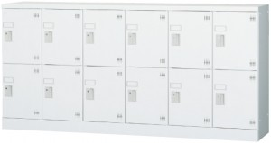

{{first:2020-9-9}}
# 請願第3号 本の宅配貸出サービスを要介護1以上の方に限定せず、様々な理由で来館っが困難な方にも拡大することについて

<i class="fa fa-gavel" aria-hidden="true"></i> 生活文教委員会付託

<fieldset class="point">
  <legend>
    <h2 class="point"> ポイント </h2>
  </legend>
  
✔ 以下2点についての請願

  
✔ 要介護1以上に限らず図書館に通うことが困難な方も本の宅配貸出サービス対象者へ

  
✔ 仲町図書館で実施している貸出ロッカーを他の図書館にも導入を

</fieldset>

## 概要

以下の内容で請願が提出されました。生活文教委員会で審議します。

> 受理年月日：令和2年8月24日  
>
> 件名：本の宅配貸出サービスを要介護1以上の方に限定せず、様々な理由で来館が困難な方にも拡大することについて  
>
> 請願者：光山明美  
> 紹介議員：橋本久雄、佐藤えつ子、川里富美、福室英俊、きせ恵美子  
> 趣旨：  
> （請願理由）  
> 本の宅配貸出サービスは高齢者を対象に平成27年（2015年）にスタートしました。このサービスを利用できる方は介護保険に加入している要介護1以上の方です。  
> したがって、この内容では来館が困難な方でも借りることができない人が出てしまいます。例えば、長期入院、出産前後の方、家族の看護や介護等で外出困難な方、心身に障害のある方、要介護1以上ではないが図書館に通うことが困難な方などです。  
> 公共の図書館は誰もが自由に利用でき、本、新聞、雑誌が読めたりCD、DVDが鑑賞できる場でなければならないと思います。  
> 例えば、調布市の来館が困難な方への図書の宅配サービスでは利用できる方の条件として、  
> 1 市内在住で下記に該当する方、または市内の病院に長期入院中の方。  
> 2 心身の障害、高齢、病気などで、来館が困難または重い本を持ち帰るのが難しい方。  
> 3 出産前後やけがなどで、一定期間来館できない方。  
> 4 自宅で常時介護をしていて、外出が困難な方。  
>とされており、該当する方には図書を直接または郵送で届けています。利用は無料です。
> この制度に該当するかどうかは職員が申請者などに話を聞いて判断します。  
> こうした他市の事例を参考に見直しをしてください。
> 小平市の宅配貸出サービスの今年2月から7月の利用実績は、3月から5月は休館でしたが、利用者延べ人数は5人、貸出冊数は42冊でした。また、仲町図書館には閉館後もリクエスト本が受け取れる貸出ロッカーがあります。  
> この制度は仲町図書館の開館に合わせてスタートしました。昨年の利用実績は利用者延べ人数157人、貸出冊数は367冊でした。この制度を他の図書館にも拡大できないでしょうか。
>
> 以上の理由により、次の事項について請願いたします。  
> （請願事項）  
> 1 本の宅配貸出サービスは、長期入院出産前後の方、家族の看護や介護等で外出困難な方、心身に障害のある方、要介護1以上ではないが図書館に通うことが困難な方などでも利用できる制度にしてください。  
> 2 仲町図書館で実施している貸出ロッカー制度を他の図書館に拡大することを検討してください。

## 説明

### 請願者の説明

- 公共の図書館は誰でも利用できる。来館できないハンディがあるために利用条件がつけられるのは平等ではない
- 本の宅配サービスについて：
  - 平成27年になかまちテラスオープンの10月から開始
  - 当初要介護度3以上の方が対象だった
  - 令和2年1月より条件緩和で、要介護1以上で図書館への来館が著しく困難な方となった
  - 同様のサービスで一番実績があるのは調布市立図書館。利用対象者は：
    - 市内病院に長期入院
    - 心身障害
    - 病気自宅療養中
    - 来館可能でも大型本、冊数が多く重くて持ち帰りが困難な方
    - 出産前後、骨折等で一定期間来館できない方
    - 自宅で家族の介護をし、外出困難な方
  - 調布市立図書館の宅配ボランティア人数は52人、宅配回数は1,712回、延べ11,171冊
  - 三鷹市立図書館も同様のサービスで、利用対象者は：
    - 心身の障害、病気などで来館できない方
    - 出産及び市内の病院に長期入院、または入所し外出のできない方
    - 三鷹市市外の方でも市内に長期入院、入所されている方
    - 来館困難な方は一度ご相談くださいとの記載もあり臨機応変な姿勢を感じる
  - 三鷹市立図書館はPR不足で利用者も少なく、職員が配達している。将来的には利用者を増やして宅配ボランティアを募集したいとのこと
  - 武蔵野市立図書館は、来館が難しい子どもとその保護者を対象に、月1回福祉施設への出張、おはなし会と本の貸し出し、図書館見学会を実施している
  - 付け加えれば、幼児、幼児の双子、子だくさんの家庭にもサービスを利用してほしい
- 貸出ロッカーについて：
  - 色々なライフスタイル、働き方で図書館開館中に来館できない方のために、仲町図書館前に設置してあるような貸出ロッカーを各館に備えて欲しい
  - ボランティアが対面で本を届けることで、見守り、安否確認となる

😄 異世界の住人である議員や理事者の前で、請願の説明や質疑に応じるということは、本当に勇気のいることだと思います。それでも、人々のしあわせを願って、こうしてご提案くださることは本当にありがたいことです。

### 筆頭紹介議員（橋本久雄議員）の説明
- 光山さんから相談に来られて、議会の仕組みが分からない中での請願は大変と感想をもった
- 本の宅配サービスについて：
  - このサービスが出来た経緯は不明
  - 要介護度3以上は、たとえば寝たきりの高齢者。なぜ介護度で基準を決めたか不明
  - このサービスについては「高齢者のしおり」にも書かれていない
  - 市ホームページのトップにも表示されていない
  - 図書館のホームページでハンディキャップサービスのところに掲載されているが、これをトップページに出して欲しい
  - 本を借りて読みたいけれども借りに来られない人は、要介護度に関係なくいる、そういった方も読めるようにして欲しいというのが趣旨
  - ボランティアの人数が不足するかもしれないが、お金はかからない、早くやってほしい
  - サービスの周知をもっとしっかりやってほしい
- 貸出ロッカーについて：
  - せっかく仲町図書館でいいサービスを作ったのだから他の図書館にも拡大してほしいというのが趣旨
  - 少なくとも中央図書館くらいはあっても良い
  - 中央図書館横の中央公民館が22時まで開設しているので、そこに預けるなど、臨機応変に検討して欲しい

😄 とても良い提案がいくつも含まれていると思います。中央図書館の隣にある中央公民館を利用して、22時頃まで本の受取りが可能になるような方法はすぐに実現できると思います。インターネットで検索すると、ダイヤル式のロッカーを販売している業者がすぐに出てきます。たとえば12個分あるロッカーは、定価13万円ほど、中古で4万円弱、新品でも8万円程度から購入できます。すぐに購入してもいいくらいだと思います。

[豊国工業のダイヤル錠ロッカー・12人用深型](http://www.houkokukk.co.jp/?page_id=456#a06)

また、宅配サービスのボランティアをしたい方も沢山いる状況ですから、対象者の拡大はすぐにでもやっていいことでしょう。なぜやらないのか不思議です🤔

### 理事者側の説明（利光図書館長）
- 本の宅配サービスについて：
  - 平成27年11月から、65歳以上、要介護3以上の高齢者を対象に宅配貸出サービスを開始
  - 利用者の数が伸び悩んでいたことから令和2年1月からは年齢要件をなくし、要介護1以上で来館が著しく困難な型に緩和
  - 居宅支援事業所等にチラシ配布を予定していたが、コロナ禍で中止、図書館自体も休館
  - 宅配ボランティアは、平成27年は20人いたものの令和2年度当初は7人に減少
  - 宅配サービスの他に郵送サービスもある
  - 請願については、長期入院の方には病院の協力が得られるかがポイントになる
    - コロナ禍で部外者が病院に入ることが難しい状況もある
    - 市内の一部病院では、病院の協力の下、患者の方が院内のインターネットを使えるパソコンで予約をし、病院の職員が取りまとめて代理人として月に1回図書館まで本を取りにきて患者の方に渡すという例もある
  - その他さまざまな利用要件を設ける場合に、図書館職員が最初に面会をして判断する。要介護の場合は明確な公的基準があるので問題とならないが、その他の要件には明確な基準がなく、図書館の職員では判断が難しい場合もあり、公平性の観点から、明確な判断ができるような基準を設ける必要がある
  - ボランティアの方で成り立つ事業なので、段階的に少しづつ進めなと事業が成り立たなくなる懸念がある
  - 今後チラシを配布するなど広報を進めて1月に緩和した要件での実施状況の分析をする
  - 以上の理由から、請願で例示されているすべての状況の方に、直ちに宅配貸出サービスを広げることは困難と考えるが、事業の推移を分析した上で段階的、部分的な実現は可能と考える

<table class="simple" style="margin:0 auto">
<caption>小平市・本の宅配サービス利用状況</caption>
<tr><th>年度末</th><th>利用登録者数</th><th>宅配回数</th></tr>
<tr><td>平成27年度*1</td><td>1</td><td>5</td></tr>
<tr><td>平成28年度</td><td>1</td><td>11</td></tr>
<tr><td>平成29年度</td><td>2</td><td>18</td></tr>
<tr><td>平成30年度</td><td>2</td><td>12</td></tr>
<tr><td>令和元年度</td><td>5</td><td>11</td></tr>
<tr><td>令和2年度*2</td><td>6</td><td>11</td></tr>
<tr><td colspan=3>*1 平成27年度は11月からの5か月間 *2 令和2年度は9月末時点の数字</td></tr>
</table>

- 貸出ロッカーについて：
  - 仲町図書館のロッカーは平成27年のリニューアルオープンに合わせ、閉館後でも予約した資料の受け取りができるように、建物に埋め込む形で設置
  - ロッカーの数は10箱あり、利用者は次の日の開館前までに受取るシステム
  - 8箱は、縦10cm x 横30cm、残り2箱はその2倍のサイズ
  - 事前にロッカーの番号と暗証番号を伝え、その暗証番号を合わせると開く
  - 利用状況は、2日に1件程度
  - 設置費用は特注のため1台140万円～150万円、それ以外に工事費で1か所300万円程度
  - 雨で濡れないようにする必要がある
  - 他市の図書館では図書のICタグとの連携でゲートで区切られたスペースの中に棚をおいて運用しているところが増えている
  - 小平市内では閉館時間に雨漏りの心配なく人が自由に入れる場所が少ないため、仲町図書館のようなスタイルで広めることは難しいと考える
  - 小川駅西口の公共床が予定されているところなど建て替えや大規模な改修が予定されている場合であれば検討は可能

🤔 知恵を絞れば、既存の施設でも安くサービスが提供できると思います。たとえば先ほど書いたようなロッカーを活用するとか、大雨で本が濡れる心配があるならロッカーの外側にカバーをつけるとか。デジタル式の鍵が高コストなら、盗まれないようにワイヤーを溶接したダイヤル式南京錠で代用するとか。

<strong>出来ない理由を探すために頭を使うのではなく、「どうやったらできるか」に職員は頭を使ってほしいものです。</strong>

## 主な質疑（発言順）
【注】 以下は要約ですので、正確な質疑内容は[会議録](./index.md#会議録配布資料)をご参照ください。分かりやすくするため、実際の質問内容に修正を加えたところもあります。簡略化のため、敬語表現を省いている場合があります。実際はほぼすべての答弁において、敬語表現で回答がなされています。

### 請願者への質疑

<table class="qanda"><tr><td><i class="fa fa-question-circle-o" aria-label="公明党議員による質問"></i></td><td>
宅配貸出サービスを必要としている方の現状の人数は。（他会派の委員）
</td></tr></table>

> 何人いるかは分からない。今後の予想も分からない。（光山 氏）

 
<table class="qanda"><tr><td><i class="fa fa-question-circle-o" aria-label="公明党議員による質問"></i></td><td>
仲町図書館にある宅配ボックスは来館困難者対応ではないと理解しているが、この点についてはどうか。（他会派の委員）
</td></tr></table>

> 時間外も利用できるという意味で便利なシステムだと考えている。（光山 氏）

 
<table class="qanda"><tr><td><i class="fa fa-question-circle-o" aria-label="公明党議員による質問"></i></td><td>
今すぐにやってほしいということか。（他会派の委員）
</td></tr></table>

> 予算があれば順次実施してほしい気持ち。宅配サービスを受けられなくても、歩いて移動できる方は、その貸出ロッカーを利用することである意味平等になる。（光山 氏）

 
<table class="qanda"><tr><td><i class="fa fa-question-circle-o" aria-label="公明党議員による質問"></i></td><td>
宅配ボックスのイメージは。（他会派の委員）
</td></tr></table>

> 壁に設置してあり、高さは成人の目の高さくらい、幅は本が入るくらい、横70センチくらい。ポストのようになっていて、貸出カード末尾4桁を入力してダイヤルを回せば開く仕組み。（光山 氏）

 
<table class="qanda"><tr><td><i class="fa fa-question-circle-o" aria-label="まちづくり小平議員による質問"></i></td><td>
ご自身も宅配ボランティアをされているご経験があると思うが、実際どう感じて来たか、この請願を出すに至った思いは。（他の委員）
</td></tr></table>

> 最初は要介護3以上が対象者で、これでは本を読む人がいないという状況で、ボランティアは当初17人いたが半分に減った。その後要介護1以上が対象と緩和されたので、9人のボランティアがいる。自分はボランティアとして活動したことは一度もない。今月はボランティアの依頼がないため活動はなしですというメールが5年以上届いている。利用者が地区に住んでいないと活動がない。（光山 氏）

### 紹介議員への質疑

<table class="qanda"><tr><td><i class="fa fa-question-circle-o" aria-label="公明党議員による質問"></i></td><td>
ニーズが低いと指摘せざるを得ない。ボランティアが足りていない状況であれば次の一手を考える必要があるが、この段階でこれほどの規模のことをやるのは妥当なのかという判断がある。ただし合理的配慮をできるだけ短い時間で進める側面もあり、時にかなったものを具体的に出た時に進めるという格好の方が良いのではないか。（他会派の委員）
</td></tr></table>

> 利用実績は延べ人数で157人、何回も借りる人がいるので実人数はその3分の1以下ではないかと想像はできる。この要介護1という条件を外せばニーズは広がる。どこまで広がるか分からないが、合理的配慮という立場からすれば介護度1以上という条件は変えるべきと考える。（橋本 久雄 議員）

 
<table class="qanda"><tr><td><i class="fa fa-question-circle-o" aria-label="公明党議員による質問"></i></td><td>
要望されたボックスを設置するとなると何百万から何千万になる。それは無理があるのでは。（他会派の委員）
</td></tr></table>

> 外付けのものでどこに置くか、コストを下げるとか、立派なものを作ってほしいということではなく内容が伴えばよい。（橋本 久雄 議員）

 
<table class="qanda"><tr><td><i class="fa fa-question-circle-o" aria-label="公明党議員による質問"></i></td><td>
後付けで何かつけるとなると相当コストがかかる。設計段階からそういう思想を取り入れられないか言っていった方がいいと思うが（他会派の委員）
</td></tr></table>

> 今後小川とか新規に建てるものについては当然つけて欲しいと思っている。（橋本 久雄 議員）

 
<table class="qanda"><tr><td><i class="fa fa-question-circle-o" aria-label="政和会議員による質問"></i></td><td>
ニーズが低いのは、周知が足りていないのではないか。（他会派の委員）
</td></tr></table>

> 周知は不十分なので、周知を徹底し、制度設計を変更することで、ニーズは当然増えると考えている。（橋本 久雄 議員）

### 理事者側への質疑

<table class="qanda"><tr><td><i class="fa fa-question-circle hitori" aria-label="一人会派 その他議員による質問"></i></td><td>
私が以前住んでいた町では、ブックモービル（移動図書館）がなく、それを実現するために何人かの職員で一生懸命学校をまわったりしていた。誰もが利用できるためにそういう努力をする必要があると考える。要介護度を条件にしようという発想はどこから来たのか。（伊藤 央）
</td></tr></table>

> ハンディキャップサービスとして身体障害者の方に郵送するといったサービスがもともとあった。その上で、介護認定の高齢者の方がどうしても来館が困難と考えて平成24年頃に図書館の設置及び運営上の望ましい基準が制定され、その中で図書館の役割として宅配サービス実施に努めるという規定がされた。要介護度という明確な基準があり、制度として進めやすいというところから進めた。まったく何もないところから始めたため、どの程度の利用があるか読めないところもあり、かなり絞る形でとは思うが、要介護度3から始めた。（利光 図書館長）

 
<table class="qanda"><tr><td><i class="fa fa-question-circle hitori" aria-label="一人会派 その他議員による質問"></i></td><td>
コロナ禍で止まっているという話だったが、チラシ配布以外でどのようなアナウンスをしているのか。（伊藤 央）
</td></tr></table>

> チラシ以外に1月の市報等にも掲載していた。機会を捉えて広報するとともに、図書館のホームページ等で周知していく（利光）

 
<table class="qanda"><tr><td><i class="fa fa-question-circle hitori" aria-label="一人会派 その他議員による質問"></i></td><td>
条件を緩和したら利用者が増えている傾向があるのは間違いない、できない理由を考えるのではなく、どうやったらできるかを考えて欲しい。多くの人に図書館を利用してほしいとか、読書文化が広がってほしいという発想は間違いなくあるのか。（伊藤 央）
</td></tr></table>

> 図書館としてここが終着点とは考えていない。ただこの事業を広げるにはどれくらいの利用があるか、それに対してボランティアの方でマンパワーがどれくらいあるかのバランスを見る必要がある。利用が伸びるよう努めていき、同時にボランティアの方の募集等も進めていきたい。（利光）

 
<table class="qanda"><tr><td><i class="fa fa-question-circle-o" aria-label="生活者ネット議員による質問"></i></td><td>
対象者の人数は検討したか。（他会派の委員）
</td></tr></table>

> もともとの65歳以上要介護3では対象者は市内全体で2,600人程度、要介護1以上だと6,000人近く。（利光）

 
<table class="qanda"><tr><td><i class="fa fa-question-circle-o" aria-label="まちづくり小平議員による質問"></i></td><td>
ロッカーに雨がかかる心配については、スーパーなど屋外に宅配ボックスがある。津田図書館などは大きなひさしがあり、雨を防げる場所にあるが、どうか。（他会派の委員）
</td></tr></table>

> 施設によって東京都から施設を借りている、例えば津田図書館や大沼図書館は、建物のほうに躯体に取り付けたりがしづらい、一件一件見ていく必要がある。（利光）

😤 スーパーの宅配ボックスについての件が答弁漏れでしたね。やる気がないと感じられても仕方がない答弁でした。

## 取り扱いについて

新たな請願を出すためという理由から、この請願については取り下げ願書が出され、承認されました。