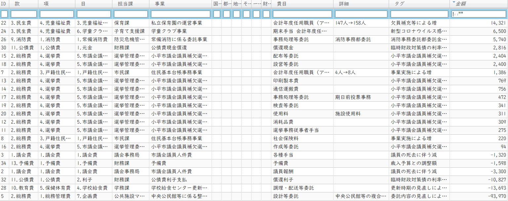

{{first:2020-11-30}}

# ⛏️ 議案第71号 令和2年度小平市一般会計補正予算（第7号）

＊作成中

<i class="fa fa-gavel" aria-hidden="true"></i> 総務委員会付託

<fieldset class="point">
  <legend>
    <h2 class="point"> ポイント </h2>
  </legend>
  
✔ 総額約△7.3千万円＝国1.5千万＋都0.4千万＋地方債△5.6千万+基金△3.8千万

  
✔ 市議会議員の死去に伴う補欠選挙経費の増と議員報酬の減

  
✔ 市立保育園の職員不足が解消されないため会計年度任用職員採用による報酬の増

  
✔ コロナ禍対策による学童クラブ会計年度任用職員の期末手当の増

  
✔ マイナンバーカードコールセンターの事業実施による業務委託経費の増

  
✔ 中央公民館等の複合化の整備に係る設計の見直しに伴う減額と債務負担行為の変更

  
✔ 学校給食センター更新時期の見直しに伴う代替給食の減額と債務負担行為の変更

  
✔ 3園分の私立保育園園舎建築補助に係る債務負担行為の追加

  
✔ 繰越し明許費の設定

  
✔ 新規のコロナ禍対策はなし

  
✔ 政和会より組替え動議が出され、当会派のみ賛同、否決される

</fieldset>

<fieldset class="sanpi">
  <legend>
    <h2 class="sanpi"> 私（安竹洋平）の判断：⭕️賛成 </h2>
  </legend>

今回は以下の問題点はあるものの、反対する合理的な理由がないため賛成しました。また、政和会より出された組替え動議にも賛成しています。

  
⚠️ コロナ禍を乗り越えるための将来へ向けた投資に関する予算が計上されていない

</fieldset>

## 目次
- [概要](#概要)
- [解説](#解説)
  - [補正予算を分析する](#補正予算を分析する)
    - [👁️‍🗨️ふらっとビューア予算歳出 ver 1.0](#ふらっとビューア予算歳出-ver-101)
- [主な質疑（発言順）](#主な質疑発言順)
  - [＠ 本会議](#-本会議)
  - [＠ 総務委員会](#-総務委員会)
    - [総務委員会での賛否](#総務委員会での賛否)
- [本会議でのやり取り](#本会議でのやり取り)
<!--
  - [原案に対する討論](#原案に対する討論)
  - [原案に対する賛否](#原案に対する賛否)
-->

## 概要

市長報告はここをクリックで開きます

> 今回の補正予算は､11月臨時会において、前倒しで提案させていただきました新型コロナウイルス感染症に関する事業以外のものとして、年度の終盤に向けて事業費の過不足を調整するとともに､事業内容の見直しに伴う債務負担行為の補正や、年度内に完了が見込めない事業に繰越明許費を設定するものです。
>
> 歳出の主な内容ですが、市議会議員補欠選挙にかかる経費を計上するほか、マイナンバーカードにかかるコールセンター､及び受付業務委託や､市立保育園、及び学童クラブにおける会計年度任用職員にかかる経費を計上いたします。
>
> また、中央公民館等の複合化の整備にかかる設計の見直しや、学校給食センター更新時期の見直しに伴い、それぞれの事業費の減額と債務負担行為を変更するとともに、学校給食センター更新については、繰越明許費を設定いたします。
>
> このほか､待機児童対策のためのわ詮し笠保育園園舎建築補助や、指定管理者の指定を受ける施設の指定管理料にかかる債務負担行為を追加いたします。
>
> 補正予算の規模といたしましては､歳入歳出それぞれ7千392万9千円を減額し、歳入歳出予算の総額をそれぞれ943億6千628万7千円とするものです。
>
> 財源構成といたしましては､国、及び都支出金を増額するとともに、基金繰入金、及び市債を減額いたします。

年度の終盤に向けて事業費の過不足を調整するとともに、事業内容の見直しに伴う債務負担行為の補正を行い、年度内の完了が見込めない事業に繰越し明許費を設定するものです。コロナ禍の対応のための予算計上はありません。

1. 市議会議員補欠選挙に係る経費
1. マイナンバーカードコールセンター及び受付業務委託に係る経費
1. 市立保育園及び学童クラブにおける会計年度任用職員（アシスタント職）に係る経費
1. 中央公民館等の複合化の整備に係る設計の見直しに伴う減額と債務負担行為の変更
1. 学校給食センター更新時期の見直しに伴う代替給食の減額と債務負担行為の変更
1. 3園分の私立保育園園舎建築補助に係る債務負担行為の追加
1. 指定管理者の指定を受ける施設の指定管理料に係る債務負担行為の追加
1. 年度内の完了が見込めない事業に繰越明許費を設定

## 解説

### 🕵補正予算を分析する

#### 👁️‍🗨️ふらっとビューア（予算歳出） ver 1.0.1

ふらっとビューアを使って歳出の詳細を確認できます。<a href="../20200803_rinjikai/gian-44.md##ふらっとビューア予算歳出-ver-10">使い方はこちらに記載しました</a>。

  

    <label>令和2年12月補正予算（第7号）詳細</label>
    <button id="grouping">款・項・目でまとめない</button>
    <button id="fullscreen">フルスクリーンで表示する</button>
  

  

<link rel="stylesheet" href="../css-each/slick.grid.css" type="text/css"/>
<link rel="stylesheet" href="../css-each/jquery-ui.css" type="text/css"/>
<link rel="stylesheet" href="../css-each/slick.pager.css" type="text/css"/>
<link rel="stylesheet" href="../css-each/examples.css" type="text/css"/>

##### 金額順歳出

それぞれの費目の詳細については、下記の質疑をご参照ください。

## 主な質疑（発言順）
{{#include ../partials/situgi_hanrei.md}}

### ＠ 本会議

<table class="qanda"><tr><td><i class="fa fa-question-circle hitori" aria-label="一人会派 その他議員による質問"></i></td><td>
債務負担行為について「中央公民館等の複合化の整備にかかる設計業務委託に係る設計変更」で事業費が1.7億円増の理由と内訳は。（中江美和）
</td></tr></table>

> 内訳は、当初予算では約2.2億円の債務負担行為を令和3～4年度で組んでいた。中央エリアで進めている下記の事業を令和2～4年度の債務負担として予定していた。  
> - 福祉会館跡地に新建物の建築設計
> - 福祉会館の解体設計
> - 外構工事の整備設計
>
> 今回債務負担期間が令和3～6年度と変更になり、この額が約3.7億円。増額は福祉会館関係の設計業務委託のみならず以下を含んだものとして組んでいる。  
> - 健康福祉事務センターの解体設計
> - その後の多目的エリアの整備設計
> - 中央公民館の解体設計
> - その跡地の利活用と駐車場の整備設計
>
> 理由は、今年度に入り事業者へのヒアリングを進めた結果、3つのエリアを総体的に進めた方がコストメリットがあり、より目的にかなう設計委託ができるとなったため。
>
> 影響については、設計については進め方が変わるものの、現在の施設を引き続き使うことになるため、施設利用の方々への影響はない。（有川 行政経営担当部長）

 
<table class="qanda"><tr><td><i class="fa fa-question-circle hitori" aria-label="一人会派 その他議員による質問"></i></td><td>
給食センターの不調による更新時期が2年先延ばしになり、代替給食の事業費も2.2千万円ほど増えている。不調による給食の開始時期の影響はないと説明していたが、2年も先延ばしになった理由と影響は。（中江美和）
</td></tr></table>

> 当初令和4年9月からの供用開始予定が5か月後ろ倒しで令和5年2月供用開始。代替給食は令和3年1月から開始予定が令和3年4月からになるため、教育費で減額補正。後ろ倒しで債務負担行為の期間が変更になり、代替給食期間が実質2か月程度伸びることから金額を変更するもの。（川上 教育部長）

 
<table class="qanda"><tr><td><i class="fa fa-question-circle hitori" aria-label="一人会派 その他議員による質問"></i></td><td>
給食センター更新事業で繰越し明許費が追加でついているが、契約不調でやりのこしたものは。（中江美和）
</td></tr></table>

> 繰越し明許費の内容は、解体工事前の廃棄物処理業務のうち、排水処理施設の汚泥回収と清掃等処理委託、解体工事の廃棄物等処理委託（主に建物に固定していない備品等の廃棄）。これらの年度内執行が困難と判明したため。4月中旬ごろまでかかる。やり残しは特にない。（川上 教育部長）

 
<table class="qanda"><tr><td><i class="fa fa-question-circle hitori" aria-label="一人会派 その他議員による質問"></i></td><td>
令和4年に開設する保育園3園の公募時期、設置場所、補助金交付等のスケジュールは。  
また、来年度の建設分を補正7号で債務負担行為設定する理由は。（中江美和）
</td></tr></table>

> 公募は、年度内に開始したい。設置場所は特に待機児童が多い、花小金井南趙、鈴木町、回田町あたり。スケジュールは、公募→事業者からの提案書類で決定→予算確保→工事着工→令和4年開設。補正7号で債務負担行為設定の理由は緊急待機児童対策で、議会にも知らせている。来年度の債務負担が確実となっているため、債務負担行為を設定する。具体的な予算は改めて来年度の適切な時期に議会に上げる。（伊藤 子ども家庭部長）

### ＠ 総務委員会
総務委員会には、一人会派の会から橋本久雄議員が委員として参加しています。

#### マイナンバーカードコールセンター事業に関して

<table class="qanda"><tr><td><i class="fa fa-question-circle-o" aria-label="その他 議員による質問"></i></td><td>
マイナンバーコールセンターの状況は。
</td></tr></table>

> 現在、職員及び会計年度任用職員専門職で電話対応をしている。電話問い合わせ件数が増えていることから今回委託し、電話を1台から3台に増やして対応を充実させる。（山本 市民課長）

 
<table class="qanda"><tr><td><i class="fa fa-question-circle-o" aria-label="その他 議員による質問"></i></td><td>
マイナンバーカードの現時点での市内交付率と目標値は。
</td></tr></table>

> 令和2年10月末現在で4万6740枚を交付しており、交付率は23.9%。目標は全ての国民が所有すること。（山本 市民課長）

 
<table class="qanda"><tr><td><i class="fa fa-question-circle hitori" aria-label="一人会派 その他議員による質問"></i></td><td>
マイナンバーカードの職員の交付率は。（橋本久雄）
</td></tr></table>

> 市民課では把握していない。（山本 市民課長）

 
<table class="qanda"><tr><td><i class="fa fa-question-circle hitori" aria-label="一人会派 その他議員による質問"></i></td><td>
マイナンバーカードは個人情報を集約するということで危険性が非常に大きい。市はどう考えているか。（橋本久雄）
</td></tr></table>

> 安全性を含めって、国に対しては常に安全性の確保と、市民の不安を取り除くということを第一に考えて取り組むよう常に申している。今後もその点については慎重に対応しながらマイナンバーの交付を進めたい。（山本 市民課長）

 
<table class="qanda"><tr><td><i class="fa fa-question-circle hitori" aria-label="一人会派 その他議員による質問"></i></td><td>
ということは全国市長会などでマイナンバーカードに対する意見書を挙げた事例があるのか。（橋本久雄）
</td></tr></table>

> 令和2年10月30日に、東京都市民課長会から総務省に対して、今回の交付申請書の再交付に関する対応についての慎重な対応ということで要望書を出している。東京都の市民課長会としても総意をまとめ、国に対して意見を申すと共に東京都市長会に本件については報告をしている。（山本 市民課長）

#### 中央公民館等の複合化の整備に係る設計の見直しに関して

<table class="qanda"><tr><td><i class="fa fa-question-circle-o" aria-label="その他 議員による質問"></i></td><td>
見直しを行う背景は。
</td></tr></table>

> 当初以下のように考え個別に最適な事業者の選定を想定していた。
> - 新建物 → 設計
> - 健康福祉事務センターの多目的エリア → 土木的要素
> - 中央公民館を解体した後の跡地利用 →　コンサルティング・市場調査
>
> ヒアリングを進めたところこれらを一体的にできる事業者が複数いることが分かった。その方がスケールメリットがありコストメリットも出ることを確認したため方針を転換した。公募型のプロポーザルを想定している。（濱本 公共施設マネジメント課長）

 
<table class="qanda"><tr><td><i class="fa fa-question-circle-o" aria-label="その他 議員による質問"></i></td><td>
見直しによるメリット・デメリットは。
</td></tr></table>

> メリットは、敷地について個別に検討するよりエリア全体で検討した方が選択肢が広がる。またコストメリットがあり、事業者からの見積りでは三つの敷地を別発注で設計するより、一本でまとめて設計業務委託で発注する方がおおむね2,000万円程度のコストメリットがある。
> デメリットという表現が適当かというところはあるが、供用開始期間が2年程度遅れること。施設の利用については既存の施設がそれまで使えるため市民に大きな影響を与えるものではない。（濱本 公共施設マネジメント課）

 
<table class="qanda"><tr><td><i class="fa fa-question-circle-o" aria-label="その他 議員による質問"></i></td><td>
市民広場はどれくらいの期間使えなくなるのか。
</td></tr></table>

> 現在の市民広場へ新建物の建築に約3年、その後健康福祉事務センターを解体し新しい多目的エリアを整備するのに約2年を見込んでいる。そのため5年程度市民広場の活用ができなくなる期間が生じると想定している。（濱本 公共施設マネジメント課長）

#### 学校給食センター更新事業について

<table class="qanda"><tr><td><i class="fa fa-question-circle-o" aria-label="その他 議員による質問"></i></td><td>
自校直営方式は検討したか。
</td></tr></table>

> 自校直営方式は、中学校8校に新たな給食室の設置と、各校に栄養士や調理員の配置が新たに必要となる。基本的な方向性を定めた時にセンター方式が最適であろうということで、センター方式で進めたいと考えている。（飯島 学務課長）

 
<table class="qanda"><tr><td><i class="fa fa-question-circle-o" aria-label="その他 議員による質問"></i></td><td>
代替給食の際、地場野菜の供給についてどう考えているか。
</td></tr></table>

> 代替給食はランチボックス方式を検討している。地場野菜の導入率が下がることは避けられない。野菜の下処理に制限があり、カット野菜として納品する必要がある。カット野菜は保健所の許可する工場での加工が必要になる。一方、外部の工場で加工してから学校に配送するような小平の梨のゼリーやキムチ、トウモロコシの皮をむいてもらうなど加工を行ってもらい給食の向上に運んでもらうことも考えていきたい。JAと連携し検討を進める。（飯島 学務課長）

 
<table class="qanda"><tr><td><i class="fa fa-question-circle hitori" aria-label="一人会派 その他議員による質問"></i></td><td>
地場野菜の使用率は。また、親子方式は検討したか。コストの比較は行ったか。（橋本久雄）
</td></tr></table>

> 地場野菜の使用率は令和元年度で小中学校とも31%超。平成29年に「小平市立学校給食センターの整備に関する基本的な方向性」を出した時点で検討している。コストの比較までは手元にないが、施設面でかなり困難があるということでセンター方式を選択している。（飯島 学務部長）

#### 市立保育園の会計年度任用職員（アシスタント職）に関して

<table class="qanda"><tr><td><i class="fa fa-question-circle-o" aria-label="その他 議員による質問"></i></td><td>
欠員補充ということで147人から158人に増えていることの詳細は。
</td></tr></table>

> 年度当初、年度途中で辞めた方もいるのでそういったところの欠員補充。下記の合計で11人。
> - アシスタント職での4人分
> - 育児休業、産前産後休暇のところで5人分
> - 傾向児？が増えているところの対応で2人分
>
> (森田 保育課長)

#### 学童クラブの会計年度任用職員（アシスタント職）に関して

<table class="qanda"><tr><td><i class="fa fa-question-circle-o" aria-label="その他 議員による質問"></i></td><td>
報酬が増えていることの詳細は。
</td></tr></table>

> 本年3月以降小学校の臨時休業を受け、6月中旬まで学童クラブは12時開所を午前8時15分から前倒しで開所していた。そのほか部屋の清掃や消毒のため従来業務より作業内容が増加したことに対応するもの。期末手当が想定より多くなり、予算不足になったため補正で増額する。（石野 子育て支援課長）

#### 保育園3園の債務負担行為に関して

<table class="qanda"><tr><td><i class="fa fa-question-circle hitori" aria-label="一人会派 その他議員による質問"></i></td><td>
これまで1園で2億円そこそこだったのが1園で3億円程度と見積っている理由は。（橋本久雄）
</td></tr></table>

> 以前は60人規模が大半だったものを、今回待機児童数が大幅に増えたため最大限である80人規模の施設を三つということで計上していること、資材調達費用や人件費が高騰していることも反映したため。（森田 保育課長）

 
<table class="qanda"><tr><td><i class="fa fa-question-circle hitori" aria-label="一人会派 その他議員による質問"></i></td><td>
当初予算で計上せず、なぜ債務負担行為を設定するのか。（橋本久雄）
</td></tr></table>

> 今回の待機児童対策は緊急的で、急遽9月下旬に今後5年間の対策を打ち出した。そのとき、令和4年4月に3園の開設を目指すことも打ち出している。令和3年度に入ってからの事務などでは、以前から事業者からも整備期間が短いという指摘を受けていた。担当としても今回の12月補正予算で債務負担設定をさせてもらい、可決頂いたのち直ちに公募が可能になることから、今年5月に行った待機児童対策よりも前に、全体のスケジュール的にも余裕ができるということで進めたい。令和4年4月に解説なので今年度から十分に期間をとって進められるため、事業者側にもよりよい提案、子どもにとって良い環境や保護者の希望に沿えるような保育園をより多くの事業者から受けられると考えている。（森田 保育課長）

 
<table class="qanda"><tr><td><i class="fa fa-question-circle-o" aria-label="その他 議員による質問"></i></td><td>
80人規模の保育園について、年間ランニングコストの想定は。
</td></tr></table>

> 市の負担額として、0歳～5歳の園は5,000万円、1歳～5歳の園は3,500万円程度。国の補助を加えると、1億円から2億円のランニングコストになる。（森田 保育課長）

<table class="qanda"><tr><td><i class="fa fa-question-circle hitori" aria-label="一人会派 その他議員による質問"></i></td><td>
（）
</td></tr></table>

<table class="qanda"><tr><td><i class="fa fa-question-circle-o" aria-label="その他 議員による質問"></i></td><td>
</td></tr></table>

#### 総務委員会での賛否

<table class="simple">
<tr><th>会派</th><th>賛否</th></tr>
<tr><td>一人会派の会</td><td>⭕賛成</td></tr>
<tr><td>政和会</td><td>❌反対</td></tr>
<tr><td>公明党</td><td>⭕賛成</td></tr>
<tr><td>フォーラム小平</td><td>⭕賛成</td></tr>
<tr><td>共産党</td><td>⭕賛成</td></tr>
</table>

## 本会議でのやり取り

### 討論
＊概要ですので、実際の討論は[会議録等](index.md/#会議録配布資料)をご参照ください。

<h5 style="margin-bottom:0">⭐反対（一人会派の会：伊藤央）</h5>

- 
- 

<h5 style="margin-bottom:0">反対（政和会）</h5>

<h5 style="margin-bottom:0">賛成（公明党）</h5>
<h5 style="margin-bottom:0">賛成（フォーラム小平）</h5>
<h5 style="margin-bottom:0">賛成（共産党）</h5>
<h5 style="margin-bottom:0">賛成（まちづくり市民こだいら：水口議員）</h5>

## 原案に対する賛否
[賛否についてはこちらをご覧ください。](./index.md#賛否)

